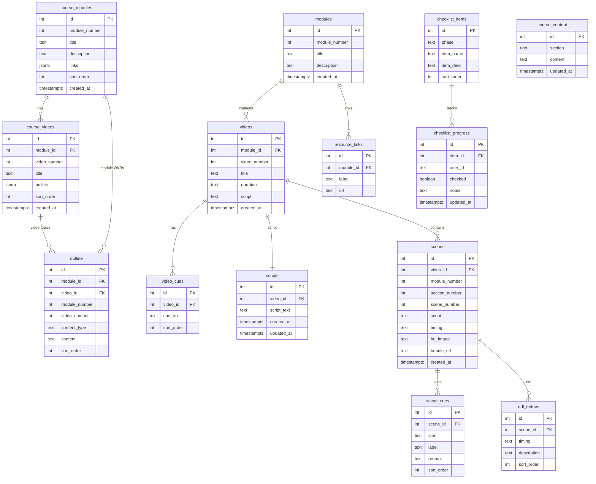

# 🗄️ Database — Supabase Schema & Quick Links

**Project:** `rmekfsdhglyiralxvkwc` · **URL:** `https://rmekfsdhglyiralxvkwc.supabase.co`

---

## 🔗 Low-Tech Checks (click to open)

| Check | Link |
|-------|------|
| 📋 Table Editor | [Browse all tables](https://supabase.com/dashboard/project/rmekfsdhglyiralxvkwc/editor) |
| 🧪 SQL Editor | [Run ad-hoc queries](https://supabase.com/dashboard/project/rmekfsdhglyiralxvkwc/sql/new) |
| 📊 API Docs | [REST & realtime endpoints](https://supabase.com/dashboard/project/rmekfsdhglyiralxvkwc/api) |
| 🔐 Auth / Users | [User management](https://supabase.com/dashboard/project/rmekfsdhglyiralxvkwc/auth/users) |
| 📜 Logs Explorer | [Live query & error logs](https://supabase.com/dashboard/project/rmekfsdhglyiralxvkwc/logs/explorer) |
| ⚙️ Settings | [Keys, JWT, URLs](https://supabase.com/dashboard/project/rmekfsdhglyiralxvkwc/settings/api) |

### Direct Table Links

| Table | Rows |
|-------|------|
| [course\_modules](https://supabase.com/dashboard/project/rmekfsdhglyiralxvkwc/editor?table=course_modules) | Course module metadata |
| [course\_videos](https://supabase.com/dashboard/project/rmekfsdhglyiralxvkwc/editor?table=course_videos) | Videos per module |
| [modules](https://supabase.com/dashboard/project/rmekfsdhglyiralxvkwc/editor?table=modules) | Production pipeline modules |
| [videos](https://supabase.com/dashboard/project/rmekfsdhglyiralxvkwc/editor?table=videos) | Videos with scripts |
| [scenes](https://supabase.com/dashboard/project/rmekfsdhglyiralxvkwc/editor?table=scenes) | Scene-level production data |
| [checklist\_items](https://supabase.com/dashboard/project/rmekfsdhglyiralxvkwc/editor?table=checklist_items) | Sanity checklist items |
| [checklist\_progress](https://supabase.com/dashboard/project/rmekfsdhglyiralxvkwc/editor?table=checklist_progress) | Per-user checklist state |
| [outline](https://supabase.com/dashboard/project/rmekfsdhglyiralxvkwc/editor?table=outline) | Module objectives & topics |
| [scripts](https://supabase.com/dashboard/project/rmekfsdhglyiralxvkwc/editor?table=scripts) | Full video scripts |

---

## 📐 ER Diagram

---

## 🗂️ Table Groups

| Group | Tables | Used By |
|-------|--------|---------|
| Course Outline | `course_modules`, `course_videos`, `outline` | `course_outline.html` |
| Production Pipeline | `modules`, `videos`, `video_cues`, `resource_links`, `scripts` | `production_hub.html`, preprod editors |
| Scenes / Post-Prod | `scenes` *(FK → videos)*, `scene_cues`, `edl_entries` | `production_shotlist.html` |
| Checklist | `checklist_items`, `checklist_progress` | `sanity_checklist.html` |
| Misc | `course_content`, `milestones`, `milestone_progress`, `pricing`, `courses` | script editors, membership page |

---

## 🛠️ Database Setup Files

| File | Purpose |
|------|---------|
| [`5_Symbols/src/supabase/schema.sql`](../5_Symbols/src/supabase/schema.sql) | Full consolidated schema defining all 18 tables and RLS policies |
| [`5_Symbols/src/supabase/seed.sql`](../5_Symbols/src/supabase/seed.sql) | Consolidated seed data (checklist, modules, videos, outline, milestones, pricing) |

> **To reset:** Paste the schema or seed file content into the [SQL Editor](https://supabase.com/dashboard/project/rmekfsdhglyiralxvkwc/sql/new) and run it. All statements are safe to re-run.
