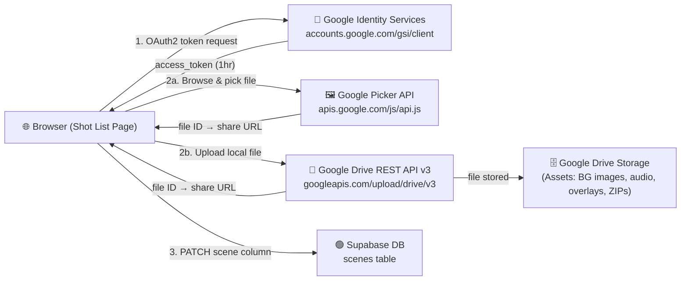

# 🌍 Environment: Google Drive Integration Setup

> **Stage:** `2_Environment` — Context & Constraints  
> **Formula doc:** [`4_Formula/google_oauth_drive_picker.md`](../4_Formula/google_oauth_drive_picker.md)  
> **Errors:** [`6_Semblance/error_google_oauth_no_origin.md`](../6_Semblance/error_google_oauth_no_origin.md) · [`6_Semblance/error_google_drive_api_disabled.md`](../6_Semblance/error_google_drive_api_disabled.md)

---

## 🎯 Purpose

Google Drive is the **asset storage layer** for the Production Shot List. Production assets (background images, voice-over audio, overlay PNGs, ZIP bundles) are stored in Google Drive and referenced by URL in Supabase. The integration provides:

- **📁 Drive Picker** — browse & select existing Drive files; URL auto-fills in the scene form
- **⬆️ Upload** — upload local files directly from the browser; sets public sharing and saves the URL to Supabase automatically

---

## 🏛 Where Google Drive Fits in the Architecture



---

## 📋 GCP Project Details

| Field | Value |
|---|---|
| 🏷 Project name | `leafy-winter-477609-k0` |
| 🔢 Project number | `327591678159` |
| 📧 Owner | `rifaterdemsahin@gmail.com` |
| 🔐 OAuth Client | `productionhelper` (Web application type) |
| 🆔 Client ID | See `.env` → `GOOGLE_CLIENT_ID` / Key Vault `claude-architect-GOOGLE-CLIENT-ID` |

---

## 🔌 APIs — Must Be Enabled

Both APIs must be **explicitly enabled** in the GCP Console. OAuth credentials alone are not sufficient.

| API | Direct Link | Used For |
|---|---|---|
| **Google Drive API** | [Enable →](https://console.cloud.google.com/apis/library/drive.googleapis.com?project=leafy-winter-477609-k0) | File upload, permissions, metadata |
| **Google Picker API** | [Enable →](https://console.cloud.google.com/apis/library/picker.googleapis.com?project=leafy-winter-477609-k0) | In-browser file picker UI widget |

> ⚠️ Without Drive API: `403 PERMISSION_DENIED — Google Drive API has not been used in project 327591678159 before or it is disabled`  
> ⚠️ Without Picker API: the `📁 Drive` picker widget silently fails to load

---

## 🔑 OAuth Scopes Required

Configured at: [console.cloud.google.com/auth/scopes?project=leafy-winter-477609-k0](https://console.cloud.google.com/auth/scopes?project=leafy-winter-477609-k0)

```
https://www.googleapis.com/auth/drive.file
https://www.googleapis.com/auth/drive.readonly
```

| Scope | Purpose |
|---|---|
| `drive.file` | Upload new files + manage files this app created |
| `drive.readonly` | Read and list ALL Drive files (required for the Picker to show existing files) |

---

## 🌐 Authorized JavaScript Origins

Configured at: [console.cloud.google.com/apis/credentials](https://console.cloud.google.com/apis/credentials) → `productionhelper` → Edit

| Origin | Environment |
|---|---|
| `http://localhost:8765` | Local dev server (`npx serve .` or `python -m http.server 8765`) |
| `http://localhost` | Local fallback |
| `https://rifaterdemsahin.github.io` | GitHub Pages (production) |

> **Rule:** `scheme + host + port` only — no path, no trailing slash.  
> Missing origins → `401 invalid_client / no registered origin`

---

## 🍪 Credential Storage

Credentials are auto-bootstrapped from multiple sources (priority order):

```
Cookie  →  localStorage  →  hardcoded default  →  persist to both
```

The Google Client ID is stored in:
- 🍪 Cookie: `google_client_id` (365-day expiry)
- 💾 localStorage: `google_client_id`
- ⚙️ Settings modal (user can update via `⚙️` button on the Shot List page)
- 🔒 Azure Key Vault: `claude-architect-GOOGLE-CLIENT-ID` (backup/recovery)

---

## 📁 Asset → Supabase Column Map

When a file is uploaded via `⬆️ Upload`, the Drive URL is automatically saved to the correct Supabase column:

| Form Field | Supabase Column | Asset Type |
|---|---|---|
| Background Image URL | `bg_image` | PNG / JPG background |
| Voice-over Audio URL | `audio_url` | WAV / MP3 narration |
| Lower Third Image URL | `lt_image` | PNG lower third graphic |
| Overlay Lower Third URL | `overlay_lt` | PNG overlay |
| Overlay Text Image URL | `overlay_text` | PNG text overlay |
| Bundle ZIP URL | `bundle_url` | ZIP scene bundle |

---

## 🔄 File Sharing Policy

All uploaded files are automatically set to **Anyone with the link can view** (`role: reader, type: anyone`) so they are accessible without a Google login on the published page and in Supabase-loaded scene cards.

---

## 🧪 Quick Verification Checklist

- [ ] Both APIs enabled in GCP Console (Drive + Picker)
- [ ] `drive.file` + `drive.readonly` in OAuth consent scopes
- [ ] `http://localhost:8765` + `https://rifaterdemsahin.github.io` in Authorized Origins
- [ ] Wait 2–5 min after any GCP changes
- [ ] Open Shot List page → click `⬆️ Upload` → Google popup appears → file uploads → `✅ Saved!`
- [ ] Check debug panel: `✅ Uploaded … ✅ Supabase: saved bg_image for scene X`
- [ ] Check Supabase table editor: column updated

---

## 🔗 Quick Links

| Resource | Link |
|---|---|
| GCP Console | [console.cloud.google.com](https://console.cloud.google.com) |
| Drive API enable | [Enable Drive API →](https://console.cloud.google.com/apis/library/drive.googleapis.com?project=leafy-winter-477609-k0) |
| Picker API enable | [Enable Picker API →](https://console.cloud.google.com/apis/library/picker.googleapis.com?project=leafy-winter-477609-k0) |
| OAuth Credentials | [Credentials page →](https://console.cloud.google.com/apis/credentials?project=leafy-winter-477609-k0) |
| OAuth Scopes | [Scopes page →](https://console.cloud.google.com/auth/scopes?project=leafy-winter-477609-k0) |
| Supabase Table Editor | [scenes table →](https://supabase.com/dashboard/project/rmekfsdhglyiralxvkwc/editor) |
| Azure Key Vault | `dp-kv-deliverypilot` (secret prefix: `claude-architect-`) |

---

## 📅 History

| Date | Event |
|---|---|
| 2026-06-08 | 🔐 OAuth Client `productionhelper` created · Drive Picker integrated |
| 2026-06-08 | 🔴 `401 no registered origin` → added localhost + GitHub Pages to origins |
| 2026-06-09 | ➕ Drive Upload (`⬆️ Upload`) added to all asset fields |
| 2026-06-09 | 🔴 `403 Drive API disabled` → enabled Drive API + Picker API in GCP Library |
| 2026-06-09 | 🔑 Scope updated: `drive.file` + `drive.readonly` |
| 2026-06-09 | ✅ Upload → Drive → Supabase PATCH pipeline working end-to-end |
