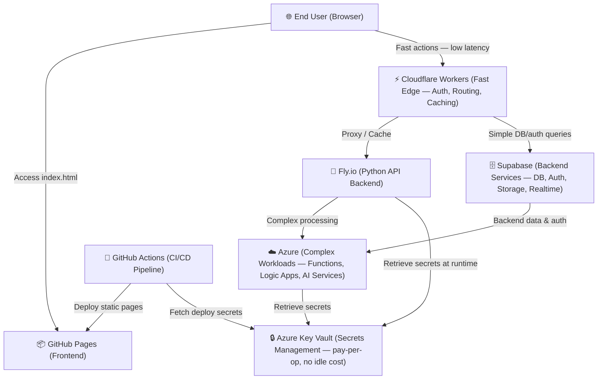

# 🏗️ System Architecture Overview

> **Stage 2 of 7 (Environment):** High-level system design, deployment layout, and component interaction.
> If the system architecture changes, developers and AI agents must update this document to keep it accurate.

---

## 🗺️ High-Level System Architecture

This project is built as a highly responsive, modern static application deployed on **GitHub Pages**, with fast edge actions handled by **Cloudflare Workers** and complex backend logic hosted on **Azure** (pay-per-operation, no idle cost) and **Supabase** for backend services.

---

## 🧩 Core Components

### 1. Frontend Static Layer (`index.html`)
- **Hosting:** Hosted directly at the root of the repository on GitHub Pages.
- **Styling & Assets:** Vanilla CSS styling, Fira Code / Outfit / Inter fonts, and FontAwesome icons loaded via CDN.
- **Routing:** Handled dynamically via `markdown_renderer.html` using query parameters (e.g. `?file=1_Real_Unknown/kanban.md`).
- **Menu System:**
  - **Project Menu:** Always visible, reads from `navigation_config.json`.
  - **Debug Menu:** Configured dynamically, toggled via a floating action button on the bottom right. Persists using cookie values (`debug=true`).
  - **Console Logger:** `debugLog` utility logs loading operations, API integrations, and routing info for developers if debug mode is active.

### 2. Edge Routing & Auth (`2_Environment/3_cloudflare_workers.md`)
- Cloudflare Workers handle **fast actions**: low-latency routing, rate-limiting, security headers, caching, and simple auth at the edge.
- Preferred entry point for anything that needs sub-10ms response times globally.
- Complex or stateful logic is delegated to Azure rather than handled at the edge.

### 3. Backend Services — Supabase
- **Supabase** provides managed backend services: PostgreSQL database, row-level security auth, file storage, and realtime subscriptions.
- Used for all standard data persistence and user auth — avoids the overhead of self-hosting a database.
- Cloudflare Workers call Supabase directly for simple queries; Fly.io uses it for application-layer data access.

### 4. Backend Services — Fly.io (`2_Environment/4_fly_io.md`)
- Hosts backend logic using Python services (FastAPI/Flask) running on Fly.io.
- Hosts vector database integration (Qdrant) and Ollama connections.
- Delegates complex workloads (e.g. AI pipelines, long-running jobs) to Azure.

### 5. Complex Workloads — Azure
- Azure hosts workloads too complex for Cloudflare Workers: Azure Functions, Logic Apps, and Azure AI Services.
- **No ongoing idle cost** — all Azure resources used are pay-per-operation (Azure Key Vault at ~$0.03/10k ops, Functions on consumption plan, etc.).
- Secrets are never stored in application code; Key Vault is the single source of truth for credentials.

### 6. Secrets Management (`2_Environment/5_setup_azure.md`)
- **Provider:** Microsoft Azure Key Vault.
- **Cost model:** Pay-per-operation only — no reserved capacity or idle charges. Standard tier: ~$0.03/10,000 operations.
- **Usage:** Stores all API keys, database credentials, and deployment keys. Secrets are loaded at runtime by backend environments or injected during CI/CD steps.

---

## 🛠️ How to Keep This Document Updated

1. **Keep Diagrams in Sync:** If new components are added (e.g. database layers, external OAuth providers), update the Mermaid graph above.
2. **Review Environment Configs:** Ensure that changes here match setup instructions in `6_setup_mac.md`, `7_setup_windows.md`, and `8_setup_ai.md`.
3. **Verify Rendering:** Ensure that Mermaid rendering works on the compiled web page via `markdown_renderer.html`.

---

## 📚 Related Documents

- [2_github_pages.md](2_github_pages.md) — Frontend static hosting
- [3_cloudflare_workers.md](3_cloudflare_workers.md) — Edge compute
- [4_fly_io.md](4_fly_io.md) — Backend hosting
- [5_setup_azure.md](5_setup_azure.md) — Secrets management
- [6_setup_mac.md](6_setup_mac.md) — macOS setup
- [7_setup_windows.md](7_setup_windows.md) — Windows setup
- [8_setup_ai.md](8_setup_ai.md) — AI stack setup
- [9_navigation.md](9_navigation.md) — Navigation system
- [10_production_setup.md](10_production_setup.md) — Production workflow
