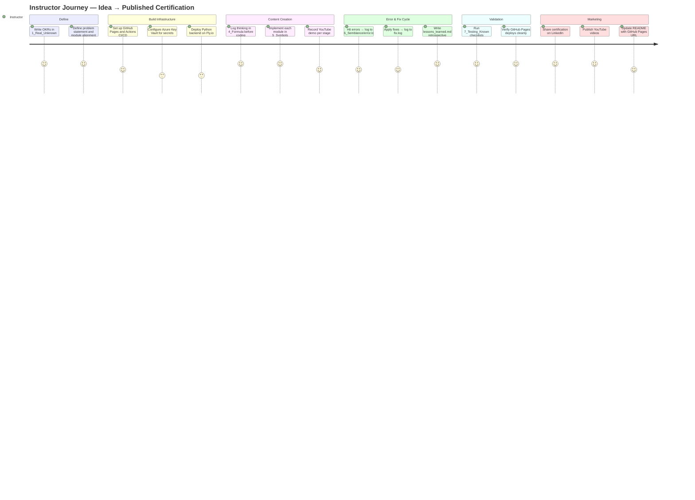
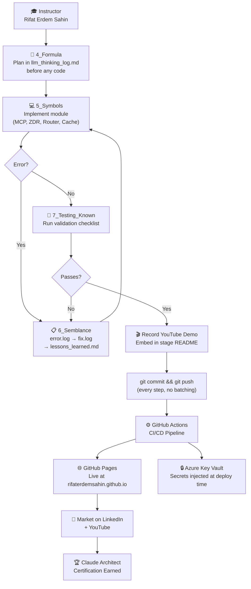
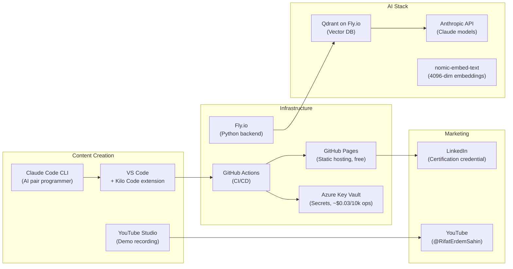
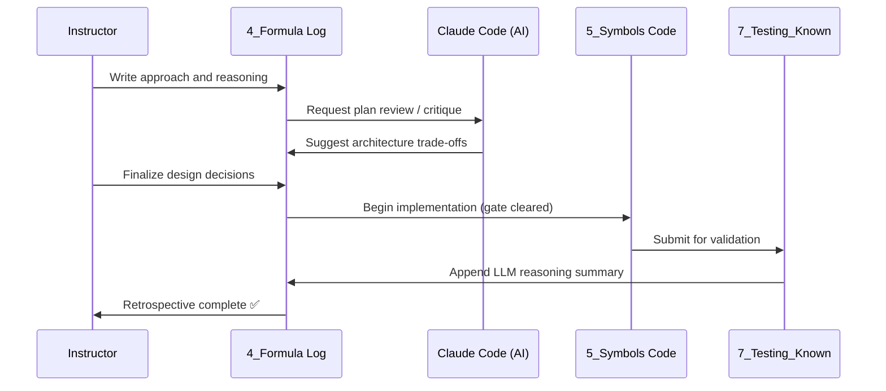

# 🎓 Instructor Experience — Claude Architect Certification Self-Learning System

> **Stage 3: Simulation** — How the creator (Rifat Erdem Sahin) builds, maintains, and teaches through this system.

The instructor is an experienced engineer who **designs the framework, records demos, commits real code, and markets the result**. This document visualizes their operational workflow, toolchain, and performance expectations.

---

## 🗺️ Instructor Journey Overview



---

## 📸 Screen 1 — Instructor Commit Workflow (Terminal + GitHub)

> **Daily operation:** The instructor writes code or content, then commits and pushes immediately — no batching. GitHub Actions auto-deploys to GitHub Pages.

**Image Generation Prompt (Midjourney / DALL-E 3):**
```text
A split-screen developer workspace. Left panel: a dark terminal showing git add, git commit, and git push commands with green success output. Right panel: a GitHub Actions workflow run page showing green checkmarks for "Deploy to GitHub Pages" steps. Clean dark theme, teal monospace font (Fira Code), minimal chrome. Professional developer environment aesthetic. 16:9, no device frame.
```


*↑ Generate and save as `3_Simulation/generated/instructor_screen1_commit_workflow.png`*

---

## 📸 Screen 2 — 4_Formula Thinking-Before-Coding Gate

> **Mandatory gate:** Before writing any code in `5_Symbols`, the instructor documents approach and reasoning in `4_Formula/llm_thinking_log.md`. Claude Code assists with planning.

**Image Generation Prompt (Midjourney / DALL-E 3):**
```text
A developer's markdown planning document open in VS Code dark theme. The document is titled "LLM Thinking Log — Module 3: MCP Server Design". It contains a Mermaid architecture diagram at the top, followed by a reasoning section with bullet points and decision trade-offs. A sidebar shows Claude Code CLI chat responses in a panel on the right. Fira Code font, purple and teal accents, professional dev aesthetic, 16:9.
```


*↑ Generate and save as `3_Simulation/generated/instructor_screen2_formula_gate.png`*

---

## 📸 Screen 3 — Azure Key Vault Secret Management Dashboard

> **Security operations:** The instructor manages all credentials via Azure Key Vault. No secrets ever touch git. GitHub Actions and Fly.io fetch secrets at runtime.

**Image Generation Prompt (Midjourney / DALL-E 3):**
```text
The Microsoft Azure Portal UI showing a Key Vault resource named "deliverypilot-kv". The left sidebar shows "Secrets" selected. The main panel lists secret names: "ANTHROPIC-API-KEY", "QDRANT-API-KEY", "FLY-API-TOKEN", "SUPABASE-KEY". Each row shows a green "Enabled" badge and last-updated timestamp. Clean Azure blue and white UI, professional enterprise dashboard aesthetic. 16:9 browser screenshot, no device frame.
```


*↑ Generate and save as `3_Simulation/generated/instructor_screen3_azure_keyvault.png`*

---

## 📸 Screen 4 — YouTube Recording Session (Demo Per Stage)

> **Content marketing:** After each stage is validated, the instructor records a demo video and embeds the YouTube thumbnail into the stage's Testing Checklist.

**Image Generation Prompt (Midjourney / DALL-E 3):**
```text
A professional home recording studio setup for a developer. A large ultrawide monitor shows a terminal running Python code and a browser with a GitHub Pages site side by side. A high-quality USB microphone and ring light are visible. The screen shows a Claude AI API response in a split terminal. Warm ambient lighting, dark walls, tech aesthetic. Camera POV from in front of the desk. 16:9, photorealistic.
```


*↑ Generate and save as `3_Simulation/generated/instructor_screen4_youtube_recording.png`*

---

## 📸 Screen 5 — Error Log → Fix Log → Lessons Learned Cycle

> **Error tracking workflow:** When something breaks, it flows through `error.log` → `fix.log` → `lessons_learned.md`. This is the "Scars" stage — where real learning happens.

**Image Generation Prompt (Midjourney / DALL-E 3):**
```text
Three side-by-side code editor panels in dark mode. Left panel: "error.log" with red-tagged entries like "[2026-06-01] [STAGE 5] [HIGH] — MCP server port conflict". Middle panel: "fix.log" with orange entries showing "[APPLIED] — Changed port to 8080, updated fly.toml". Right panel: "lessons_learned.md" with a green retrospective paragraph. Connected with right-pointing arrows between panels. Fira Code font, clean dark UI, 16:9.
```


*↑ Generate and save as `3_Simulation/generated/instructor_screen5_error_fix_cycle.png`*

---

## 🔄 Instructor Operational Flow (Full System View)



---

## 📸 Screen 6 — GitHub Actions CI/CD Pipeline Status

> **Deployment confidence:** Every push triggers a pipeline. The instructor monitors the Actions tab to confirm the site is live and all links pass the link-checker test.

**Image Generation Prompt (Midjourney / DALL-E 3):**
```text
GitHub Actions web interface showing a workflow run for "Deploy to GitHub Pages". Green checkmark icons next to each step: "Checkout", "Setup Node", "Validate Links", "Deploy Pages". The run title shows a commit message: "feat(symbols): add MCP server implementation". Duration shows "1m 23s". Dark GitHub UI theme, professional CI/CD dashboard, 16:9.
```


*↑ Generate and save as `3_Simulation/generated/instructor_screen6_github_actions.png`*

---

## 📸 Screen 7 — LinkedIn Certification Post (Marketing Outcome)

> **Credibility marketing:** After passing the exam, the instructor publishes a LinkedIn post with the certification badge, GitHub Pages link, and YouTube playlist link.

**Image Generation Prompt (Midjourney / DALL-E 3):**
```text
A LinkedIn post on a desktop browser. The post author is "Rifat Erdem Sahin" with a professional headshot. The post text reads "Passed the Claude AI Architect Certification ✅. Here is my full open-source study system built with the 7-stage self-learning framework." Below the text is a link preview card showing the GitHub Pages site "claude-architect-certification". The post has 147 reactions and 38 comments. LinkedIn blue-and-white UI, realistic social media screenshot style, 16:9.
```


*↑ Generate and save as `3_Simulation/generated/instructor_screen7_linkedin_post.png`*

---

## ⚙️ Instructor Toolchain Overview



---

## 📊 Instructor Performance Benchmarks

| Activity | Target Time | Actual Outcome |
|----------|-------------|----------------|
| Stage planning in 4_Formula | 15–30 min | Reduces code rework by ~60% |
| Per-module implementation | 2–4 hours | One working artifact per module |
| YouTube demo recording | 20–40 min | One video per stage (7 total) |
| CI/CD deploy per push | 60–90 seconds | Live on GitHub Pages |
| Error log → fix cycle | < 1 hour | Documented in 6_Semblance |
| Full 7-stage pass | 2–3 weeks | Exam-ready knowledge |

---

## 🧠 Instructor's Mental Model — The 4-Formula Gate

The most important discipline in this system is **thinking before coding**. The `4_Formula` stage acts as a forcing function:



---

## 📌 Key Instructor Experience Principles

| Principle | Practice |
|-----------|----------|
| Commit after every step | No batching — each change gets its own commit and push |
| Think before code | `4_Formula` entry is mandatory before `5_Symbols` work |
| Every error is a lesson | `6_Semblance` turns failures into searchable knowledge |
| YouTube per stage | Every stage has a recorded demo — passive learners included |
| Secrets never in git | Azure Key Vault is the only credential store |
| Template-first mindset | This project must work as a v0.9 template for future projects |
