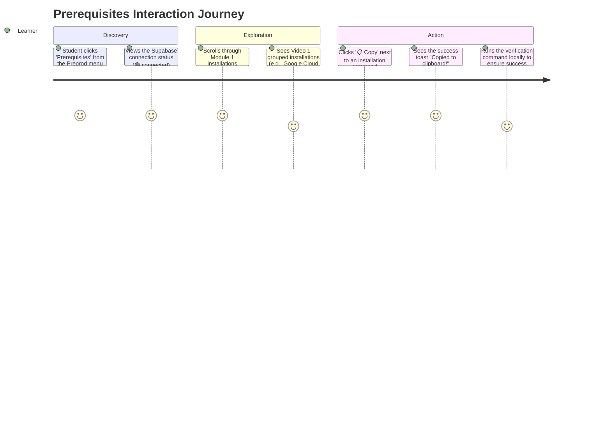

# 🎨 User Experience — Prerequisites Page Design

> **Stage 3: Simulation** — How the student views and interacts with the prerequisites page before diving into the course.

The Prerequisites page is a critical first-touch for students. It dictates whether they feel overwhelmed by the installation requirements or if they feel guided and supported. The UI is designed to be highly structured, breaking down installations module-by-module, and providing one-click copy buttons for every command.

---

## 🗺️ User Interaction Flow



---

## 📸 Screen 1 — Prerequisites Dashboard

> **What the user sees first:** A clean, dark-mode dashboard displaying glassmorphism cards for each Module. Inside each Module card, there are distinct sections for each Video, detailing exactly what needs to be installed, the terminal command, and a verification step.

**Image Generation Prompt (Midjourney / DALL-E 3):**
```text
A professional dark-mode web application dashboard displaying a list of software prerequisites. The UI uses glassmorphism panels with deep violet and teal accents. At the top, a heading reads "Prerequisites" with a small green "connected" badge. Below, there is a card for "Module 1" containing a table. The table rows show "Google Cloud CLI" and "Docker Desktop", with a sleek monospaced code block for the install commands and a prominent glowing "Copy" button next to each. Ultra-sharp UI screenshot style, clean typography, 16:9 aspect ratio, 1920x1080 resolution.
```


*↑ Generate this image using the prompt above and save as `3_Simulation/generated/user_screen_prerequisites.png`*

---

## 🎨 Design System Tokens

- **Backgrounds**: Deep dark `#030712`, with subtle transparent cards `rgba(17,24,39,0.9)`
- **Typography**: `Outfit` for headings (bold, futuristic), `Plus Jakarta Sans` for tabular data (readable, clean)
- **Accents**: Primary purple `#8b5cf6`, Success green `#10b981` (used for the connection status and toast notifications)
- **Interactive Elements**: The `Copy` button uses a subtle purple glow on hover (`rgba(139,92,246,0.25)`) to encourage clicking. Monospace command blocks use a dark contrast background (`rgba(0,0,0,0.4)`) with cyan text (`#a5f3fc`) for high legibility.
