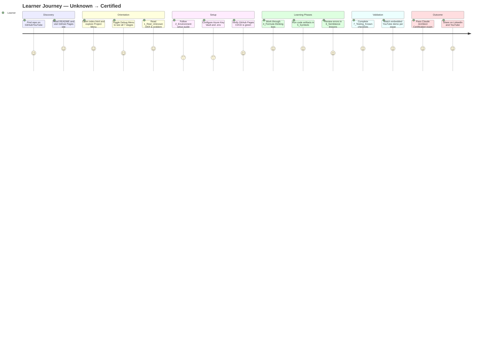
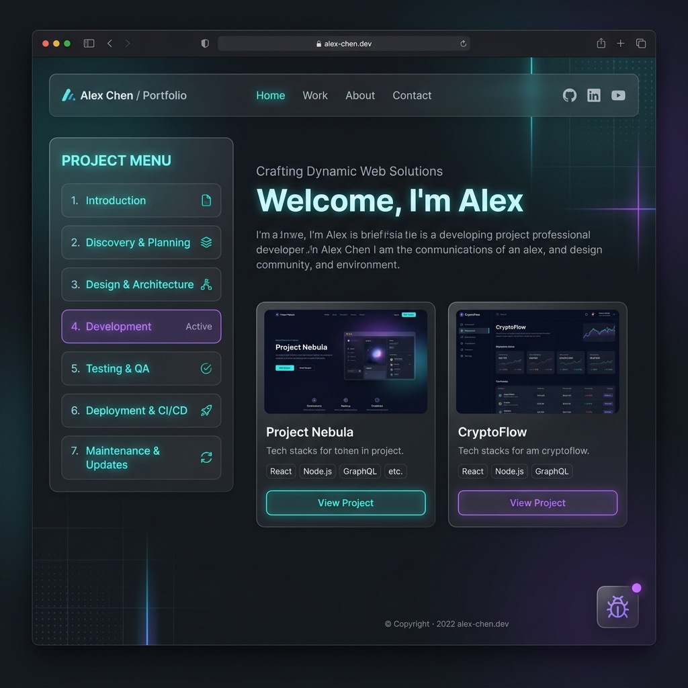
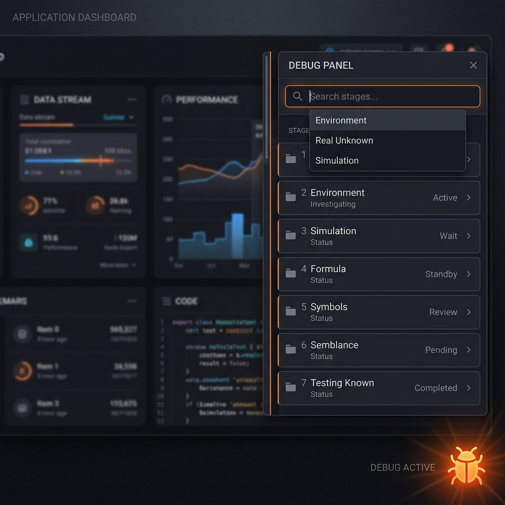
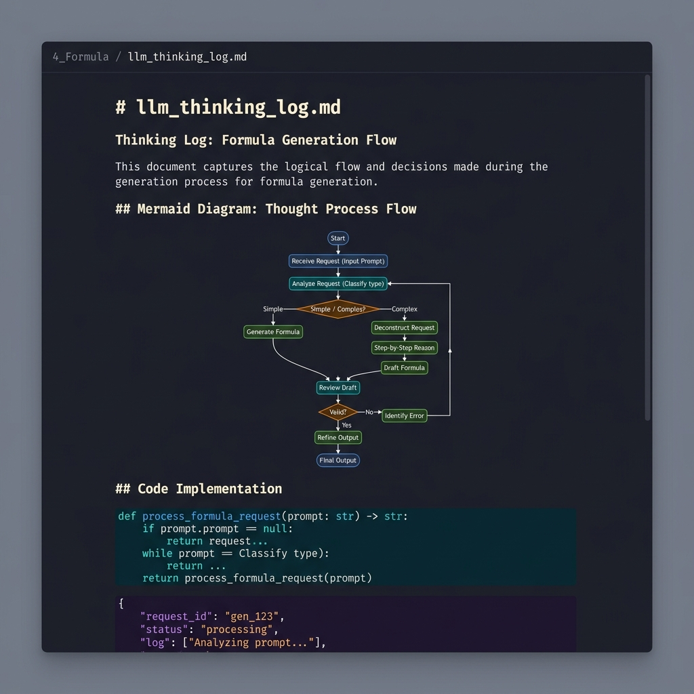
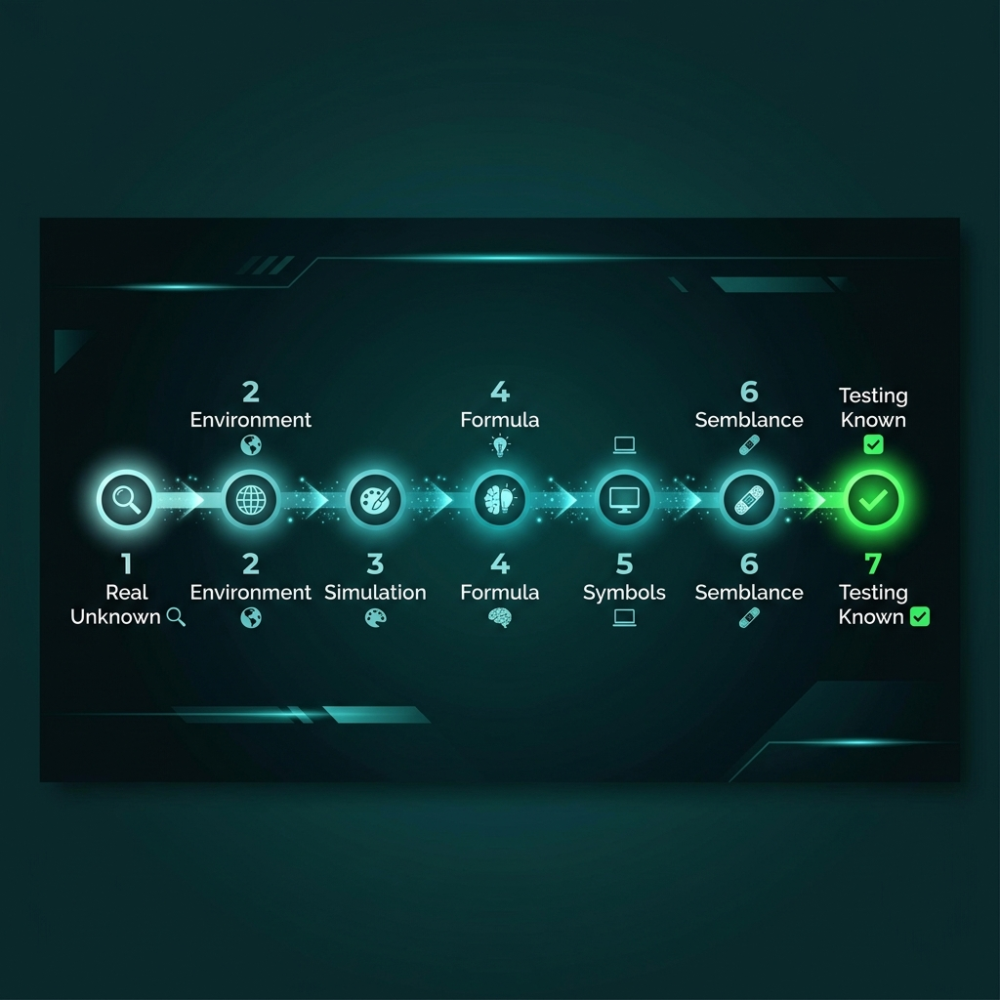
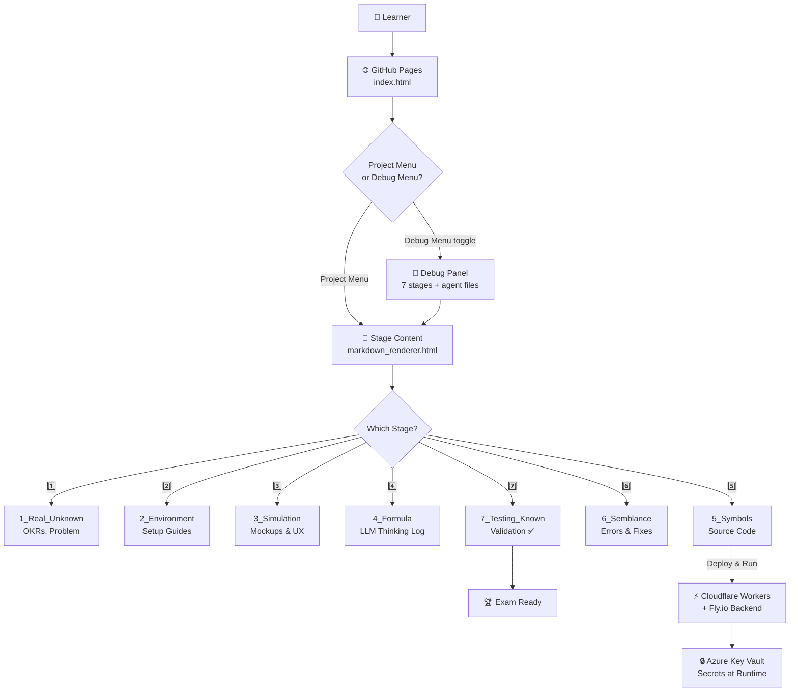

# 👤 User Experience — Claude Architect Certification Self-Learning System

> **Stage 3: Simulation** — How a learner discovers, navigates, and benefits from this system.

The primary user is an engineer or architect preparing for the **Claude AI Architect Certification** exam. They arrive at this project via GitHub, YouTube, or LinkedIn, and self-guide through 7 structured stages to go from uncertain to exam-ready.

---

## 🗺️ User Journey Overview



---

## 📸 Screen 1 — Landing Page (GitHub Pages Site)

> **What the user sees first:** The public-facing `index.html` with the Project Menu always visible, social links, and a dark-mode professional layout.

**Image Generation Prompt (Midjourney / DALL-E 3):**
```text
A professional dark-mode developer portfolio homepage displayed in a browser. Clean glassmorphism panels, teal and purple neon accents, modern sans-serif typography. Left sidebar navigation menu labeled "Project Menu" with 7 numbered stage links. Bottom-right shows a small floating bug/gear debug icon. Header shows GitHub, LinkedIn, and YouTube social icon links. Ultra-sharp UI screenshot style, no device frame, 16:9 aspect ratio, 1920x1080 resolution.
```


*↑ Generate this image using the prompt above and save as `3_Simulation/generated/user_screen1_landing.png`*

---

## 📸 Screen 2 — Debug Menu Revealed

> **What happens when the debug button is clicked:** A slide-in panel reveals all 7 stage links, agent config files, search autocomplete, and tool references — the full framework scaffold.

**Image Generation Prompt (Midjourney / DALL-E 3):**
```text
A dark-mode web application showing a floating debug panel sliding in from the right side. The panel has a search bar at the top with autocomplete dropdown, and a vertical list of 7 numbered stages: "1 Real Unknown", "2 Environment", "3 Simulation", "4 Formula", "5 Symbols", "6 Semblance", "7 Testing Known". Each item has a small folder icon. The main page behind is slightly blurred/dimmed. A glowing orange bug icon is visible in the bottom-right corner of the screen. UI design, dark theme, sharp edges, 16:9 --ar 16:9
```


*↑ Generate and save as `3_Simulation/generated/user_screen2_debug_menu.png`*

---

## 📸 Screen 3 — Markdown Renderer (Stage Reading Experience)

> **How users read each stage document:** Every `.md` file renders in `markdown_renderer.html` with syntax highlighting (PrismJS), Mermaid diagram rendering, and back-navigation.

**Image Generation Prompt (Midjourney / DALL-E 3):**
```text
A developer documentation reader interface in dark mode. The page renders a markdown document with a Mermaid flowchart diagram visible in the center, purple and teal syntax-highlighted code blocks below, and a breadcrumb header showing "4_Formula / llm_thinking_log.md". Clean monospace font (Fira Code), side padding, smooth scrolling layout. No browser chrome, pure content area, 16:9.
```


*↑ Generate and save as `3_Simulation/generated/user_screen3_markdown_reader.png`*

---

## 📸 Screen 4 — 7-Stage Progress Mental Model

> **The conceptual map a user builds:** Visualizing the journey from Unknown to Proven across all 7 stages.

**Image Generation Prompt (Midjourney / DALL-E 3):**
```text
An infographic showing a horizontal 7-step progress bar journey. Each step is a glowing numbered node on a dark background: "1 Real Unknown 🔍", "2 Environment 🌍", "3 Simulation 🎨", "4 Formula 🧠", "5 Symbols 💻", "6 Semblance 🩹", "7 Testing Known ✅". Connecting arrows between nodes. The rightmost node glows green for "proven". Flat design, minimalist, teal gradient, white text. 16:9 banner style.
```


*↑ Generate and save as `3_Simulation/generated/user_screen4_7stage_journey.png`*

---

## 📸 Screen 5 — Certification Exam Preparation Checklist

> **The final stage view:** The user reaches `7_Testing_Known` and sees a completion checklist with green checkboxes, a YouTube video embed, and a validation report summary.

**Image Generation Prompt (Midjourney / DALL-E 3):**
```text
A web-based testing checklist page in dark mode. Multiple checklist items with green glowing checkboxes on the left. A YouTube video thumbnail embedded below the list, showing a developer presenting a terminal demo. A status badge reads "7 / 7 Stages Complete" in bold teal. Clean layout, Fira Code font, small trophy icon in the header. 16:9 browser screenshot style.
```


*↑ Generate and save as `3_Simulation/generated/user_screen5_testing_checklist.png`*

---

## 🔄 User Interaction Flow (System Architecture View)



---

## 📊 Performance Experience Targets

| Touchpoint | Expected Performance | User Perception |
|------------|---------------------|-----------------|
| GitHub Pages load | < 1.5s (CDN-cached) | Instant |
| Markdown render | < 300ms (client-side) | Snappy |
| Mermaid diagram render | < 500ms | Smooth |
| Debug menu toggle | < 100ms (CSS transition) | Fluid |
| Search autocomplete | < 50ms (in-memory JSON) | Real-time |
| GitHub Actions CI deploy | 60–90s | Acceptable (behind scenes) |

---

| 📅 Stage | 📈 Learner Confidence (0-10) | 📊 Visual Trend |
|---|---|---|
| **Start** | 2/10 | ▬▬ (20%) |
| **Stage 1** | 3/10 | ▬▬▬ (30%) |
| **Stage 2** | 4/10 | ▬▬▬▬ (40%) |
| **Stage 3** | 5/10 | ▬▬▬▬▬ (50%) |
| **Stage 4** | 6/10 | ▬▬▬▬▬▬ (60%) |
| **Stage 5** | 8/10 | ▬▬▬▬▬▬▬▬ (80%) |
| **Stage 6** | 7/10 | ▬▬▬▬▬▬▬ (70%) |
| **Stage 7** | 9/10 | ▬▬▬▬▬▬▬▬▬ (90%) |
| **Exam** | 10/10 | ▬▬▬▬▬▬▬▬▬▬ (100%) |

- **Start:** Anxious — exam costs £50, 6-month lockout on failure
- **Stage 1–2:** Grounded — problem is defined, environment is mapped
- **Stage 3–4:** Visioning — can see what success looks like
- **Stage 5:** Momentum — code is running, concepts are real
- **Stage 6:** Humility — errors expose gaps, lessons sharpen understanding
- **Stage 7:** Confidence — everything is validated, exam feels achievable
- **Exam:** Ready

---

## 📌 Key UX Design Decisions

| Decision | Rationale |
|----------|-----------|
| Debug menu hidden by default | Keeps the public-facing site clean for non-technical visitors |
| Cookie-persisted debug mode | Engineers don't need to re-toggle on every page load |
| JSON-driven navigation | One config file controls both menus — easy for agents and humans to update |
| No build step / no framework | GitHub Pages works out of the box; no npm, no bundler, zero friction |
| Every stage has a YouTube embed | Passive and active learners both served — watch or read |
| Secrets via Azure Key Vault | Learners see enterprise-grade patterns in a real, low-cost deployment |
