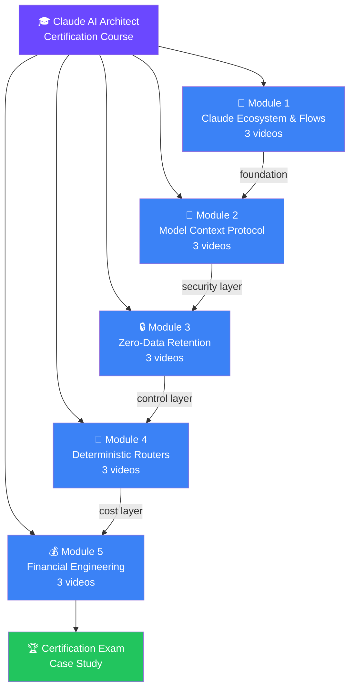
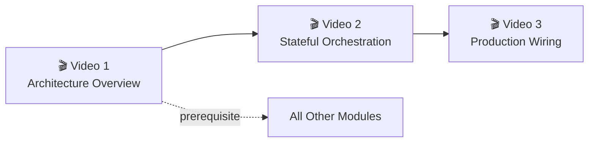
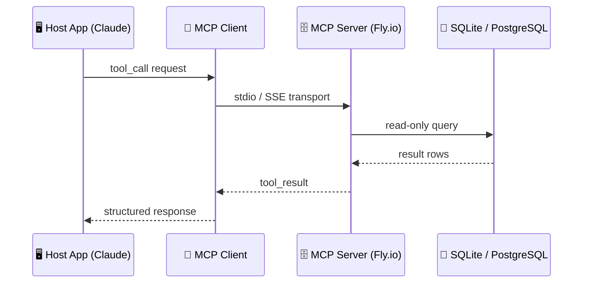
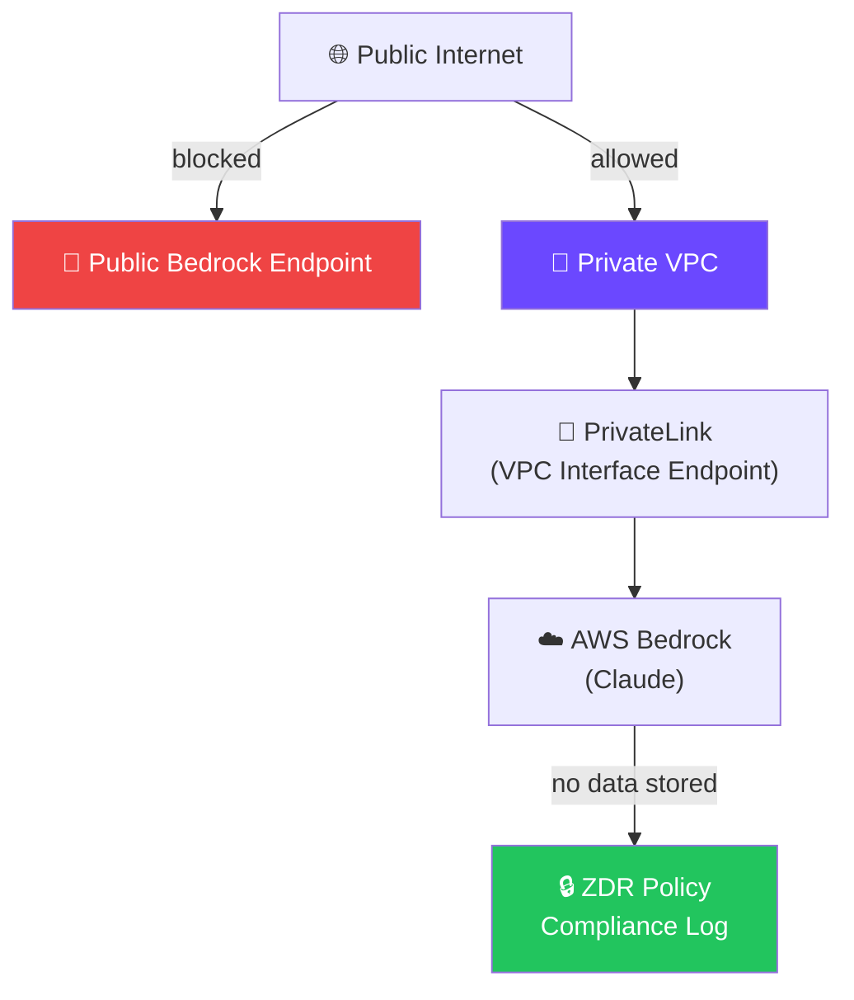
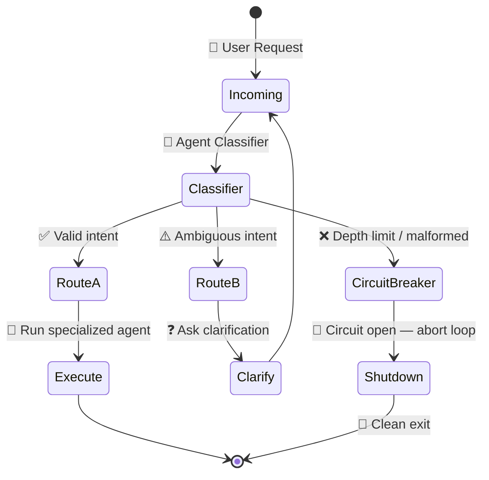
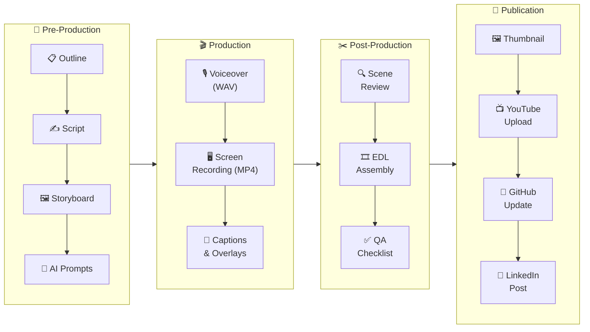
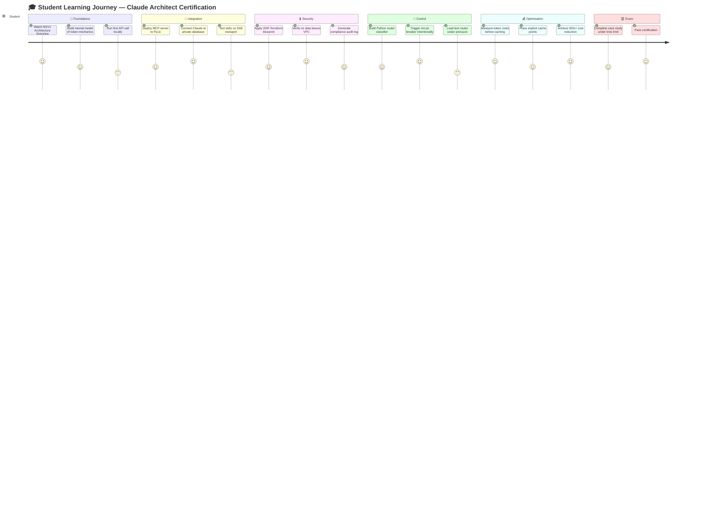
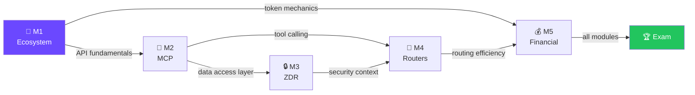
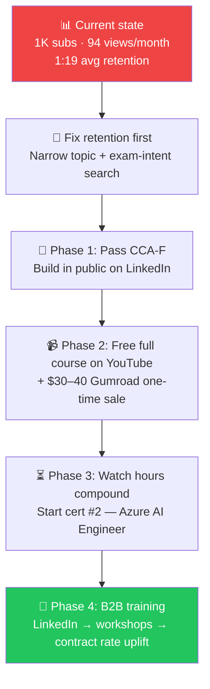

# 🎬 YouTube Course Structure — Feedback & Analysis

> **📁 Stage 4: Formula** — Thinking & planning review of the YouTube course structure for the Claude AI Architect Certification series.

---

## 🗺 Course at a Glance

---

## 📊 Structure Scorecard

| 🏷 Dimension           | ⭐ Score | 💬 Comment                                                          |
| ---------------------- | -------- | ------------------------------------------------------------------- |
| 📐 Logical progression | ✅ 5/5   | Ecosystem → MCP → Security → Control → Cost is a natural build-up   |
| 🎯 Exam alignment      | ✅ 5/5   | 1-to-1 mapping between modules and exam topics                      |
| ⚖️ Video balance       | ✅ 5/5   | Consistent 3-video-per-module rhythm — predictable for learners     |
| 💻 Hands-on density    | ⚠️ 3/5   | Theory-to-code ratio feels even; could push more live demos earlier |
| 🔗 Cross-module links  | ⚠️ 3/5   | Dependencies exist but aren't explicit to the viewer mid-series     |
| 🔰 Beginner ramp       | ⚠️ 2/5   | No introductory "zero-to-Claude" video before Module 1              |

---

## 🔬 Module-by-Module Feedback

### 📡 Module 1 — Claude Ecosystem & Flows

| 🏷 Item       | 💬 Feedback                                                                  |
| ------------- | ---------------------------------------------------------------------------- |
| ✅ Strength   | Token mechanics + architecture diagram = strong mental model anchor          |
| ✅ Strength   | Multi-agent routing patterns set up Modules 2–4 perfectly                    |
| ⚠️ Gap        | No "What is Claude?" 60-second teaser — assumes too much prior knowledge     |
| 💡 Suggestion | Add a 2-min hook video before V1: real enterprise problem → Claude solves it |

---

### 🔌 Module 2 — Model Context Protocol (MCP)

| 🏷 Item       | 💬 Feedback                                                                      |
| ------------- | -------------------------------------------------------------------------------- |
| ✅ Strength   | stdio vs SSE transport comparison is exactly what architects need                |
| ✅ Strength   | Fly.io deployment makes it immediately production-replicable                     |
| ⚠️ Gap        | "Enterprise MCP" video covers auth broadly — needs a concrete OAuth/mTLS example |
| 💡 Suggestion | Show a failing unauthenticated request BEFORE the secure fix — more memorable    |

---

### 🔒 Module 3 — Zero-Data Retention (ZDR)

| 🏷 Item       | 💬 Feedback                                                                            |
| ------------- | -------------------------------------------------------------------------------------- |
| ✅ Strength   | Terraform blueprint is the killer differentiator — no other course has this            |
| ✅ Strength   | Compliance logging adds real enterprise credibility                                    |
| ⚠️ Gap        | "Why ZDR matters" could be opened with a data-breach cost headline to create urgency   |
| 💡 Suggestion | Include a `terraform plan` live output demo — architects trust infra-as-code artifacts |

---

### 🔀 Module 4 — Deterministic Routers

| 🏷 Item       | 💬 Feedback                                                                |
| ------------- | -------------------------------------------------------------------------- |
| ✅ Strength   | Circuit breaker pattern is under-taught — this is a genuine gap-fill       |
| ✅ Strength   | Loop detection is exam-critical and well positioned                        |
| ⚠️ Gap        | No mention of timeout budgets — architects need latency SLA examples       |
| 💡 Suggestion | Add a "rogue loop" live demo in V1 showing the problem before the solution |

---

### 💰 Module 5 — Financial Engineering

| 🏷 Cache State    | 💰 Cost per 1M Tokens ($) | 📊 Visual Comparison                 |
| ----------------- | ------------------------- | ------------------------------------ |
| **No Cache**      | $15.00                    | █ █ █ █ █ █ █ █ █ █ █ █ █ █ █ (100%) |
| **50% Cache Hit** | $7.50                     | █ █ █ █ █ █ █ (50%)                  |
| **90% Cache Hit** | $1.50                     | █ (10%)                              |

| 🏷 Item       | 💬 Feedback                                                                      |
| ------------- | -------------------------------------------------------------------------------- |
| ✅ Strength   | "90% savings" headline is a compelling hook — leads with business value          |
| ✅ Strength   | Prefix-matching mechanics are technical enough to satisfy architects             |
| ⚠️ Gap        | No mention of cache TTL expiry edge cases (5-min window) — exam gotcha           |
| 💡 Suggestion | Build a live cost dashboard with real API calls — screenshot-worthy for LinkedIn |

---

## 🏗 Production Pipeline Review

| 🏷 Phase           | ⭐ Rating     | 💬 Note                                                   |
| ------------------ | ------------- | --------------------------------------------------------- |
| 🎯 Pre-Production  | ✅ Excellent  | Script + outline + AI prompts pipeline is solid           |
| 🎬 Production      | ⚠️ Good       | Needs explicit B-roll checklist for architecture diagrams |
| ✂️ Post-Production | ⚠️ Needs work | EDL template exists but composite preview step undefined  |
| 🚀 Publication     | ✅ Excellent  | LinkedIn → YouTube → GitHub cross-promotion loop is smart |

---

## 🧠 Learning Journey Map

---

## 💡 Top 5 Improvement Suggestions

| 🏷 Priority | 💡 Suggestion                                            | 🎯 Impact                        |
| ----------- | -------------------------------------------------------- | -------------------------------- |
| 🔴 P1       | Add a 2-min "zero-to-Claude" intro video before Module 1 | Lowers barrier for new viewers   |
| 🔴 P1       | Show cache TTL expiry edge case in Module 5 V1           | Covers likely exam trap question |
| 🟡 P2       | Add latency SLA / timeout budget discussion to Module 4  | Rounds out router architecture   |
| 🟡 P2       | Include a concrete OAuth/mTLS example in Module 2 V3     | Makes "Enterprise MCP" real      |
| 🟢 P3       | Build a live cost dashboard demo in Module 5 V3          | Creates shareable LinkedIn proof |

---

## 🔗 Content Dependency Graph

> 📌 **Key insight:** Module 2 (MCP) is the critical dependency — it feeds both the security track (M3) and the control track (M4). If a student skips or rushes M2, they will struggle with both downstream modules.

---

## 🎙 Raw AI Feedback Session — Key Insights

> 📅 Session date: 2026-06-10 | 🤖 Source: AI strategy review of the repo

### 🔴 Critical Gaps Identified

**1. Exam alignment gap (highest risk)**
The modules are infra-heavy (ZDR, Bedrock PrivateLink, Terraform, Fly.io). But the actual CCA-F exam weights agent architecture and orchestration highest at 27%. **Claude Code doesn't appear in the course outline at all.** Either add a Claude Code module or reposition the course as "production architecture" rather than exam prep.

**2. The word "official"**
The README calls this the "official production-grade companion" for a certification name not owned by this repo. Say "unofficial companion repo for my CCA-F prep masterclass" and add a one-line disclaimer to avoid confusion and takedown risk.

**3. 92 broken `file:///` links**
Markdown across the repo links to `file:///Users/rifaterdemsahin/...` — dead for every viewer on GitHub/Pages and leaking local paths. Extend `test_links.py` to scan all markdown, not just `5_Symbols/production`.

**4. Supabase RLS audit**
The anon key is in `index.html`, and the project ref + dashboard links appear in `.env.example`, `nav.js`, and a public `admin.html`. Audit that every table has restrictive RLS and the service key never reaches client code.

---

### 📺 YouTube Channel & Monetization Strategy

### 🏗 Recommended Business Model

| 🏷 Layer             | 💡 Approach                                     | 💰 Timeline |
| -------------------- | ----------------------------------------------- | ----------- |
| 🆓 Free tier         | Module 1 of every course + Shorts for discovery | Now         |
| 💳 One-time purchase | $30–40 per course on Gumroad (no YPP needed)    | Phase 2     |
| 🔑 Membership        | Full library access at £9.99/month after YPP    | Phase 3     |
| 🏢 B2B training      | Corporate workshops via LinkedIn — highest ROI  | Phase 4     |

### 🎯 Channel Niche Decision

**Chosen niche: AI Certifications across vendors** (CCA-F → Azure AI Engineer → GCP ML Engineer)

- ✅ Same viewer takes each cert — audience compounds instead of resets
- ✅ High search intent, thin competition right now
- ✅ Each badge posted on LinkedIn raises contract day rate
- ⚠️ Requires ~one new cert course every 6–8 weeks to sustain membership value
- ⚠️ Don't announce multi-cert identity until first complete loop (pass + course published)

### 📣 Recruiter Positioning

**Key message:** SC-cleared SRE + certified AI architect who builds in public and teaches enterprise production patterns — not prompting content.

> See `4_Formula/production/script.md` for the full LinkedIn post variants (journey, announcement, InMail reply).

---

## ✅ Feedback Action Items

- [ ] 🔴 Write and record 2-min "zero-to-Claude" intro hook video
- [ ] 🔴 Add cache TTL expiry demo to Module 5 Video 1
- [ ] 🔴 Add Claude Code module (or reposition course as "production architecture")
- [ ] 🔴 Remove "official" from README — add unofficial disclaimer
- [ ] 🔴 Fix 92 broken `file:///` links — extend `test_links.py` to all markdown
- [ ] 🔴 Audit Supabase RLS on all tables; move `admin.html` out of public repo
- [ ] 🟡 Write latency SLA section for Module 4 script
- [ ] 🟡 Add mTLS code snippet to Module 2 Video 3 (`enterprise_mcp.py`)
- [ ] 🟢 Design live cost dashboard for Module 5 Video 3
- [ ] 🟢 Create cross-module dependency callout cards for each video intro
- [ ] 📋 Update [`course_outline.md`](certification/course_outline.md) after implementing changes
- [ ] 🧪 Validate all changes against [`7_Testing_Known/`](../7_Testing_Known/) checklist

---

> 📅 Last updated: 2026-06-10 | 🤖 Stage: 4_Formula | 🏷 Type: Course Review

# raw

Sanity check my effort to create a course for youtube git@github.com:rifaterdemsahin/claude-architect-certification.git

07:26

Identified content gaps and branding risks in certification course
Identified content gaps and branding risks in certification course
Cloned and reviewed the repo (258 files, all 7 stages, code, and pipeline). Overall verdict: the bones are genuinely good — real working code (MCP server in TS, router.py, cache_layer.py, Terraform), a live production pipeline backed by Supabase, and your own link checker passes clean on the production folder. But there are four issues worth fixing before you push this harder as a public course, in priority order:

1. Exam alignment gap (biggest content risk). Your modules are infra-heavy: ZDR, Bedrock PrivateLink, Terraform, Fly.io. But the actual CCA-F exam weights agent architecture and orchestration highest at 27%, and agentic architecture and Claude Code carry the highest weight across the five domains. Claude Code doesn't appear in your course outline at all. If the course promise is "pass the cert," Module 3 (ZDR/VPC) is teaching content the exam barely tests while a top-weighted domain is missing. Either add a Claude Code module or reposition the course as "production architecture" rather than exam prep.
   Medium
   Lowcode

2. The word "official." Your README calls the repo the "official production-grade companion" for "Claude AI Certification for Architects." Anthropic's credential is the Claude Certified Architect – Foundations, and "official" next to a certification name you don't own invites confusion and takedown risk. Say "unofficial companion repo for my CCA-F prep masterclass" and add a one-line disclaimer.

3. 92 broken file:/// links. Markdown across the repo (including the README's 7-stage section and module table) links to file:///Users/rifaterdemsahin/... and file:///C:/projects/... — dead for every viewer on GitHub/Pages, and they leak your local paths. Your test_links.py only scans 5_Symbols/production, which is why it reports green. Extend it to scan all markdown and convert these to relative links.

4. Supabase exposure — verify RLS. The anon key is hardcoded in index.html (fine by design, but only if RLS is airtight), and the project ref rmekfsdhglyiralxvkwc plus dashboard links appear in .env.example, nav.js, and a public admin.html. Given you have CRUD migrations on scenes/checklists, audit that every table has restrictive RLS and the service key never reaches client code. Also consider whether admin.html belongs in a public repo at all.

Smaller notes: 7_Testing_Known/sanity_check_report.md is stale — it says index.html and .env.example are missing when they now exist, which undermines the Stage 7 "validation" credibility; regenerate it. And for a YouTube learner landing on the README, the 7-stage framework comes before the course modules — consider leading with "what you'll learn, 5 modules, 15 videos" and moving the framework explanation below, since the framework is your meta-method, not the product.

Want me to fix the file:/// links and regenerate the README module table as a patch?

Making this structure and creating menus is it worth my effort on preprod to create the course look abstract

07:35

Weighed scaffolding value against exam and video delivery priorities
Weighed scaffolding value against exam and video delivery priorities
Honest answer: partially. Split it into what compounds and what doesn't.

The menus, debug panels, markdown renderers, and dashboard polish are mostly sunk effort for this course. YouTube viewers arrive from a video, want the code for Module 2, run it, and leave. They navigate via the README and folder names — almost nobody uses a custom nav.js or production hub. And yes, the 7-stage framing makes the repo read abstract: a learner looking for "the MCP server from Video 4" has to decode 5_Symbols/course_src/ first. Your own OKR file says the real stakes are passing the exam — every hour on menu chrome is an hour not spent recording or drilling exam domains, and the exam content (agentic loops, Claude Code, tool design) is what's currently thinnest.

What is worth it: the Supabase-backed production pipeline (shot lists, checklists, progress tracking) — but as DeliveryPilot infrastructure, built once and reused across every future course, not rebuilt per repo. Same for the 7-stage template itself: keep it as your internal working method, but make the public-facing layer boringly conventional — module-1/, module-2/, README with direct links.

A decent rule: if the artifact appears on camera or gets cloned and run by a viewer, invest. If it's scaffolding only you see, timebox it hard. Right now I'd freeze the preprod tooling where it is, and put the next block of hours into the missing Claude Code module and recording — that's what moves both the cert and the channel.

I learned this module outline and script generation at the start and setting up the, uh, problem from Coursera while creating two of its courses. So I'm following that framework. I will release this course on YouTube, give one module for free, and put a paywall, a join button for the remaining courses after I get the YouTube partnership done. What do you think about this business model? And I will remove the Coursera process because it takes too much back and forth and use the AI to guide me on preproduct and production process to be able to work it out and create a side income.

07:52

Evaluated freemium YouTube model, identified paywall weaknesses, flagged timing urgency
Evaluated freemium YouTube model, identified paywall weaknesses, flagged timing urgency
The core funnel is sound — free module as lead magnet, paid access for the rest is the standard model and it works. But I'd challenge two specifics.

The paywall mechanism. The YouTube "Join" button (channel memberships) is a weak fit for course content. It's a monthly subscription, but a course is a one-time purchase — people join, binge the modules, and churn in month one, and members-only videos get zero discovery. Since you already have deliverypilot.net and Udemy presence, the stronger play is: full Module 1 free on YouTube for reach and SEO, then drive to a one-time-price course on your own platform (or Gumroad/Udemy) where you keep the margin and own the customer email. Memberships only make sense if you reframe the offer as ongoing — monthly new content, updates as Claude evolves, a community — which is more work than shipping a finite course.

The competitive position. Anthropic's own prep courses are free, and practice-exam products already flooded Udemy within weeks of the March launch. So the paid layer can't be "information" — it has to be the thing you actually have that they don't: a working enterprise build (MCP, Vault-style secrets, production pipelines) from a practicing SRE, done end-to-end on camera. That's also why speed matters more than the preprod tooling we discussed — the CCA-F window is open right now, and Anthropic has more cert tiers coming later this year, meaning the content has a shelf life.

Dropping Coursera makes sense — the review back-and-forth kills iteration speed and their revenue share is thin; using their course-design framework without their platform is keeping the best part. Using AI to run preprod/production is fine as long as it's compressing time to publish, not generating more scaffolding. The one metric that validates all of this: videos shipped per week. If the AI workflow gets you to one module recorded and published weekly, the model works; if it produces more planning documents, it doesn't.

One question that changes the math: is the DeliveryPilot channel already in the YouTube Partner Program, or is this course going on a new channel that still needs to qualify?

Delivery pilot framework is a framework that I have created, and it is helping me to do the self learning on new topics such as cloud architect certification. And I'm going to use it to be able to collect all the other certifications in the market, uh, to make sure that I can understand, to to tell, show, to apply. And once I apply, I will get the certification, and I will position myself as somebody who has passed the certification and be able to create a wrapper to be able to build the audience and in this channel I will place more and more certifications to be able to collect the trust from the audience.

08:06

Weighed framework's scalability against audience fragmentation risks
Weighed framework's scalability against audience fragmentation risks
The flywheel logic is solid: one repeatable framework, each certification becomes study material, proof (the pass), and a product (the course) simultaneously — your learning cost gets amortized three ways. And cert niches are good YouTube economics: high search intent, exam deadlines create urgency, and "I passed, here's exactly how" is inherently more trustworthy than commentary channels. Tell–show–apply with real builds is the right differentiator, since most cert content is slide-reading.

The risk is in "collect all the other certifications in the market." The channels that dominate cert niches own one ecosystem deeply — think of the AWS-only educators. An audience that subscribed for Claude architecture doesn't carry over to, say, ITIL or Salesforce; every lane change resets trust instead of compounding it. So I'd constrain the collection to a coherent identity that matches who you already are: AI/platform/cloud engineering certs — CCA-F, the advanced Anthropic tiers coming later this year, maybe AWS AI or Kubernetes. Then each new cert deepens the same viewer's trust rather than recruiting a new audience from scratch. "The engineer who certifies in everything" is a weaker brand than "the SRE who shows you how AI systems actually pass production muster."

Two practical cautions. First, sequencing: CCA-F is the proof case for the whole model — pass it, ship the course, measure revenue, and only then scale the framework to cert number two. Generalizing before the first one closes is the trap. Second, maintenance debt compounds: cert content decays with every product update, and each certification you add to the library is an ongoing update commitment, not a one-time asset. Budget for that or older courses quietly become liabilities that damage the trust you're building. But as a strategy — framework as engine, certs as fuel, trust as the compounding asset — it hangs together. The only thing it needs now is the first completed loop.

How about I set my identity on, uh, AI certification niche and focus on collecting AI certifications? And when somebody lands in, they know that I'm collecting cloud, GCP, Microsoft, all of them, all these different AI related certifications, and I expect them to stay, uh, even then longer than a month to be able to upsell the other search in the YouTube join button. What do you think? How I should monetize this and keep creating AI search, which I also adding them to my, uh, to my LinkedIn.

08:53

Validated niche coherence and architected tiered monetization strategy
Validated niche coherence and architected tiered monetization strategy
"AI certifications" as the niche fixes the coherence problem — the same viewer who takes CCA-F genuinely will take GCP ML Engineer and Azure AI Engineer next, because they're all the same career move. Cross-vendor works here in a way "all certs" didn't. And it also rescues the Join-button model I pushed back on earlier: a single course doesn't justify a subscription, but a growing library of AI cert courses does — the promise becomes "stay subscribed, the next cert is always coming." That only holds if you sustain the treadmill, though: roughly a new cert course every 6–8 weeks plus updates when exams change. Miss the cadence and churn returns.

For monetization, I'd layer it rather than rely on memberships alone:

Free tier (discovery): Module 1 of every course, exam-news videos, and Shorts. This feeds search — "CCA-F exam guide," "GCP ML Engineer 2026" are high-intent queries with weak competition right now.
YouTube membership (£4.99–9.99): full module access + a community space (Discord, study groups, exam-day debriefs). Know the math: typical conversion is well under 1% of subs and YouTube takes 30%, so 30K subs realistically yields a few hundred pounds a month at first. It's a start, not the destination.
One-time purchases on your own site: many engineers hate subscriptions; offer each course standalone at £30–50 and you capture both buyer types plus the email list, which YouTube never gives you.
The real upside — B2B: this is where your LinkedIn play matters. Each badge you post is proof-of-work in front of hiring managers and engineering leaders. "Certified across the AI stack, teaches it on YouTube" converts into corporate workshops and team training, which pay more per day than memberships pay per month. For your profile — SC-cleared SRE with enterprise clients — that's the natural endgame.
One sequencing note: don't announce the multi-cert identity before you've shipped the first complete loop. Pass CCA-F, publish the course, show the badge — then rebrand the channel around the collection with one finished exhibit already on the wall. The identity lands far harder as "watch me do it again" than "watch me attempt it."

at the start i don't hate youtube partnerships which i was trying for the last two years i couldn't get the four thousand watch time so in the beginning i'm i need to release all the course content for free then put a paywall on top of it and the first people that, uh, subscribe to the channel will be able to watch the content then i will pull the, uh, join button and hide the videos, uh, behind it what do you think about that kind of strategy And, uh, if the audience wants to not subscribe, just buy the course, uh, give it for, uh, thirty, forty dollars instead of ten dollars join button. What do you think about that kind of a value proposition? Uh, people who don't wanna subscribe, buy it one off, pay three x, four x, uh, or the others who, uh, join, uh, pay a monthly fee and get a monthly course.

08:57

Evaluated monetization strategy, flagged paywall risks, suggested alternative approach
Evaluated monetization strategy, flagged paywall risks, suggested alternative approach
The free-first phase is right — long-form cert content is exactly what fixes a watch-hours problem, since it's search-driven and people watch 20-minute technical videos to the end. But two corrections to the plan:

Don't retroactively hide the free videos. Pulling content people subscribed for and locking it behind Join is the one move that burns the early audience — the exact people whose watch time got you into the program — and it kills the search rankings those videos accumulated, because members-only videos disappear from discovery. The cleaner version: course #1 stays free forever as the flagship funnel ("the full CCA-F course, free") and the paywall starts with course #2 onwards. "The first cohort got it free" then reads as a launch story instead of a bait-and-switch, and the free course keeps generating watch hours and subscribers indefinitely.

You don't need YPP to start selling. Partnership only gates AdSense and the Join button. A $30–40 one-time course sold through Gumroad or your own site, linked in every description, works today — no watch-hours threshold. So the sequence becomes: sell one-time purchases from day one, add the membership tier later once YPP unlocks, rather than waiting two more years to earn anything.

The dual pricing itself is sound and standard: $10/month for library access while subscribed, $30–40 to own one course outright. Just make the one-time tier rationally better for its buyer — lifetime updates, repo access, downloadable materials — otherwise everyone bingeing for one $10 month and cancelling is the smarter buy and your one-time tier dies.

One diagnostic worth doing first: 30K subscribers but under 4,000 long-form watch hours in two years strongly suggests the subs came from Shorts, which don't count toward that threshold (Shorts have a separate 10M-views path). If so, the channel's audience expects 60-second content and may not convert to 25-minute modules — check your long-form average view duration before betting the model on it. If retention on long-form is weak, the cert course needs to build that audience, which changes the timeline expectations.

30k conmections in linkedin 1000 subs on youtube woth 30 videos on ai. So what is the roadmap

09:02

Architected phased growth strategy leveraging LinkedIn distribution advantage
Architected phased growth strategy leveraging LinkedIn distribution advantage
That reframes the whole plan — your distribution asset is LinkedIn, not YouTube. 30K connections in your exact buyer demographic (engineers, architects, delivery people) is worth far more right now than the channel. So the roadmap runs LinkedIn-first, YouTube as the content library:

Phase 1 — next 4–6 weeks: pass CCA-F. Nothing else matters until the badge exists; it's the credibility engine for everything downstream. Document the prep publicly on LinkedIn 2–3 times a week — domain breakdowns, anti-patterns, what surprised you. You're building launch anticipation while studying.

Phase 2 — launch month: free course + one-time product. Publish the CCA-F course free on YouTube (10–15 long-form videos). Each video gets a native LinkedIn post — insight first, link in comments — because 30K connections will drive more views than YouTube's algorithm will at 1K subs. Simultaneously sell the $30–40 extended version (practice questions, repo walkthrough, lifetime updates) on Gumroad from day one. No YPP required.

Phase 3 — months 2–6: let watch hours compound, start cert #2. Cert content is search-driven, so the free course accrues the 4K hours passively while you prep the next certification — Azure AI Engineer is the natural pick given your Microsoft-heavy enterprise background. When YPP unlocks and a second course exists, then the membership tier makes sense as a library.

Phase 4 — months 6–12: the B2B layer. This is where LinkedIn actually pays. "SC-cleared SRE, certified across the AI stack, teaches it publicly" converts to corporate training days and consulting — one workshop out-earns months of memberships. The YouTube channel's real job at your scale is being the portfolio that closes those deals.

The honest math: at 1K subs, course sales and ad revenue will be small for the first year. The realistic income order is B2B work first, one-time course sales second, memberships last. YouTube is the long game; LinkedIn is the income engine — post accordingly.

One thing to check before Phase 2: what's the average view duration on your existing 30 AI videos? That tells you whether the audience holds for long-form or whether you need tighter 8–12 minute modules.

IMG_0798.PNG
IMG_0797.PNG
IMG_0796.PNG
IMG_0795.PNG
IMG_0794.PNG
IMG_0793.PNG
IMG_0792.PNG
Current YouTube and linkedin is mostly recruiters

10:27

Reframed recruiter audience as asset for certification positioning strategy
Reframed recruiter audience as asset for certification positioning strategy
Thanks for sharing the real numbers — this changes the advice significantly, so let me be straight with you.

94 views and 2.0 watch hours in 28 days means monetization isn't the question yet. At this pace, 4,000 hours is decades away, and a paywall on a channel with 77 monthly viewers would earn close to nothing. The pricing models we discussed are answers to a problem you don't have yet. The actual problem is in two numbers on these screens: 1:19 average view duration and 94.8% new viewers. People click, leave within 90 seconds, and never come back. YouTube sees that and stops serving impressions (481 in a month). Until retention is fixed, more videos just produce more of the same.

The likely cause is the topics. "How to Learn AI," "AI No-Code," "AI Agents vs Freelancers" are commodity titles competing against channels with millions of subscribers — a viewer has no reason to pick the 30-video channel. This is actually why the CCA-F course is your best shot at first traction, but for a different reason than income: the exam is three months old, search competition is thin, and someone searching "Claude Certified Architect exam guide" has specific intent and few alternatives. Narrow, underserved, high-intent — the opposite of your current catalogue. Ship it free, watch retention per module, and treat 40%+ average-percentage-viewed as the signal you've found the format. Park every monetization decision until one video holds an audience.

On LinkedIn: "mostly recruiters" kills the course-sales funnel, but it's perfect for a different payoff — recruiters are exactly the audience for "I passed Anthropic's first architect certification, here's my build." That content raises your perceived market value and your day rate as a contractor. Honestly, that's likely where the certification pays first and biggest: a £25–50/day rate uplift on your next contract dwarfs a year of course revenue at current channel size. The channel then becomes a long-game portfolio, not this year's income stream.

So the revised roadmap: pass the exam, publish the course free, post the journey to the recruiter audience for rate leverage, and judge the channel purely on retention — not revenue — for the next six months.

Write the recruiter message

10:33

Architected recruiter messaging variants for certification announcement
Architected recruiter messaging variants for certification announcement
I just passed Anthropic's Claude Certified Architect – Foundations exam — their first official technical certification, launched in March.

It's not a prompting badge. It's a proctored, scenario-based exam on designing production AI systems: agentic architecture, orchestration, MCP integration, tool design, and context management.

I didn't just study for it — I built the whole thing in public. A working MCP server, multi-agent routing with circuit breakers, secure secrets handling, deployed infrastructure. The full repo and a free video course documenting every step are on my channel (link in comments).

Why it matters: enterprises are moving AI from pilots to production right now, and the gap isn't prompts — it's engineers who can wire AI into regulated, secure platforms. That's been my day job for years (SC-cleared SRE, OpenShift, Vault, Keycloak, national infrastructure). This certification just makes it legible.

If you're hiring for platform or AI infrastructure roles — or your clients are asking how to get Claude into production safely — happy to talk.
Three versions for three moments:

Journey post — use this one now, before the exam. It builds anticipation with the recruiter audience and makes the eventual pass a payoff they watched happen.

Announcement post — for the day the badge lands. It frames the cert as proof of production capability, not a study achievement, and ends with a hiring hook.

InMail reply — your standing template for recruiter messages. It leads with the dual specialism (cleared platform engineer + certified AI architect) and anchors the rate conversation to it.

One honest note: the announcement and reply versions claim the pass — hold them until it's real. And adjust the "15 years" figure in the journey post if it's off.

Create mark down for a b c

10:35

Deliberated file creation approach for markdown document
Deliberated file creation approach for markdown document
All three messages in one markdown file — A (journey post, usable now), B (announcement, post-pass only), C (InMail reply template), plus usage notes at the bottom.

Recruiter messages
Document · MD
I'm adding all these conversations to the production plan, especially for the postproduction, and marking them as, uh, production, delivery pilots, or the content, uh, to make sure that I don't create unnecessary noise over the signal. What do you think about this approach once the audience comes in the Omnicity content while I'm building and learning? I see the delivery pilot. And while I'm promoting, I focus on the, uh, production side. What do you think about this kind of an Roch and collecting all of it in one single place and using, uh, AI agents to go over to sanity check and to set the process.

10:41

Validated centralized system with AI gates; cautioned against meta-work trap
Validated centralized system with AI gates; cautioned against meta-work trap
The instinct is right — one place, tagged by purpose, with agents enforcing the process — and it fits the system you've already built (kanban, error logs, session files). Capturing strategy decisions like this conversation matters because in three months you won't remember why you chose free-first or recruiter positioning, and the plan is where that reasoning should live.

But apply the test we set earlier honestly: does each artifact move a video closer to published, or is it the scaffolding trap wearing a new outfit? Tagging conversations, building taxonomies, and setting up agent review pipelines all feel like progress while producing zero watch minutes. The signal/noise filter you're describing is itself capable of becoming noise. The rule I'd hardcode: anything that doesn't change what gets recorded this week is archive material, not plan material. One page of active plan, everything else is reference.

Where the AI agents genuinely earn their place is as gates, not as generators. Three checkpoints worth automating: pre-record (does this topic target a real search query, is the hook scripted for the first 30 seconds — your 1:19 retention is the metric they exist to fix), pre-publish (title/thumbnail/description against the checklist, links resolve, repo matches what's shown on screen), and post-publish (pull retention data, log what held and what lost people into 6_Semblance). An agent that reads your analytics and tells you "viewers drop at 1:40 when you open the dashboard" is signal. An agent that produces another planning document is noise with extra steps.

And the phasing you describe — learn/build mode feeding DeliveryPilot, then a deliberate switch to promotion mode — is sound, as long as the modes have exit criteria rather than vibes. Build mode ends when the module is recorded; promote mode ends when the post is published and data is logged. Otherwise build mode expands forever, because building is the comfortable part. You already know that — it's why this question exists.

# LinkedIn Recruiter Messages — CCA-F Positioning

## A — Journey Post (use now, pre-exam)

Anthropic launched its first official certification in March — Claude Certified Architect. I'm sitting it this month, and I'm preparing the way I'd build any production system: by actually building one.

So far: an MCP server in TypeScript deployed to Fly.io, a deterministic multi-agent router with circuit breakers, secrets via Key Vault, and Terraform for private LLM networking. Every step recorded and published free on my channel.

15 years of SRE and platform work taught me that the hard part of AI isn't the model — it's making it survive contact with enterprise security, compliance, and ops. That's the gap this certification actually tests.

Follow along if you want to see what production-grade Claude architecture looks like — or if your team is trying to move AI past the pilot stage, my DMs are open.

---

## B — Announcement Post (after passing — do not post before the badge is real)

I just passed Anthropic's Claude Certified Architect – Foundations exam — their first official technical certification, launched in March.

It's not a prompting badge. It's a proctored, scenario-based exam on designing production AI systems: agentic architecture, orchestration, MCP integration, tool design, and context management.

I didn't just study for it — I built the whole thing in public. A working MCP server, multi-agent routing with circuit breakers, secure secrets handling, deployed infrastructure. The full repo and a free video course documenting every step are on my channel (link in comments).

Why it matters: enterprises are moving AI from pilots to production right now, and the gap isn't prompts — it's engineers who can wire AI into regulated, secure platforms. That's been my day job for years (SC-cleared SRE, OpenShift, Vault, Keycloak, national infrastructure). This certification just makes it legible.

If you're hiring for platform or AI infrastructure roles — or your clients are asking how to get Claude into production safely — happy to talk.

---

## C — Reply to Recruiter InMail (standing template)

Thanks for reaching out. Quick summary of where I am and what I'm looking for:

Senior SRE / Platform Engineer, SC-cleared, currently delivering on UK critical national infrastructure (OpenShift, ArgoCD, Vault, Keycloak). Alongside that, I've specialised in production AI architecture — I'm certified as a Claude Certified Architect (Anthropic's foundations-level credential) and build enterprise AI integrations: MCP servers, multi-agent orchestration, secure LLM deployment patterns.

I'm interested in roles where that combination matters: platform engineering with an AI adoption mandate, or AI infrastructure roles needing someone who's run regulated production systems.

Day rate reflects the dual specialism — happy to share expectations if the role is in that space. What's the engagement?

---

### Usage notes

- **A** is safe to post today. **B** and **C** claim the certification — hold until you've passed.
- Adjust the "15 years" figure in A if needed.
- For B, put the channel/repo link in the first comment, not the post body (LinkedIn suppresses posts with external links).
