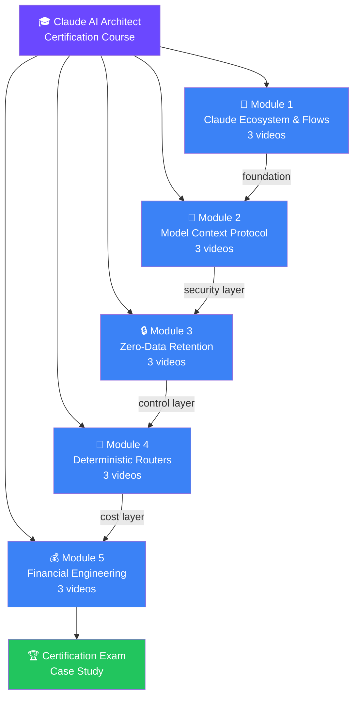
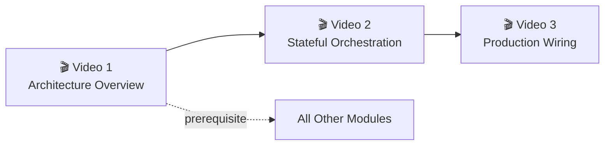
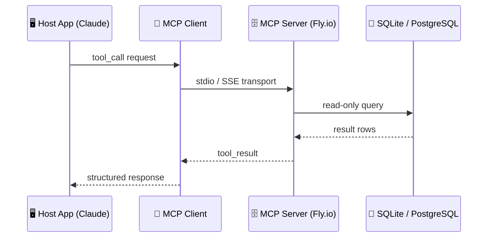
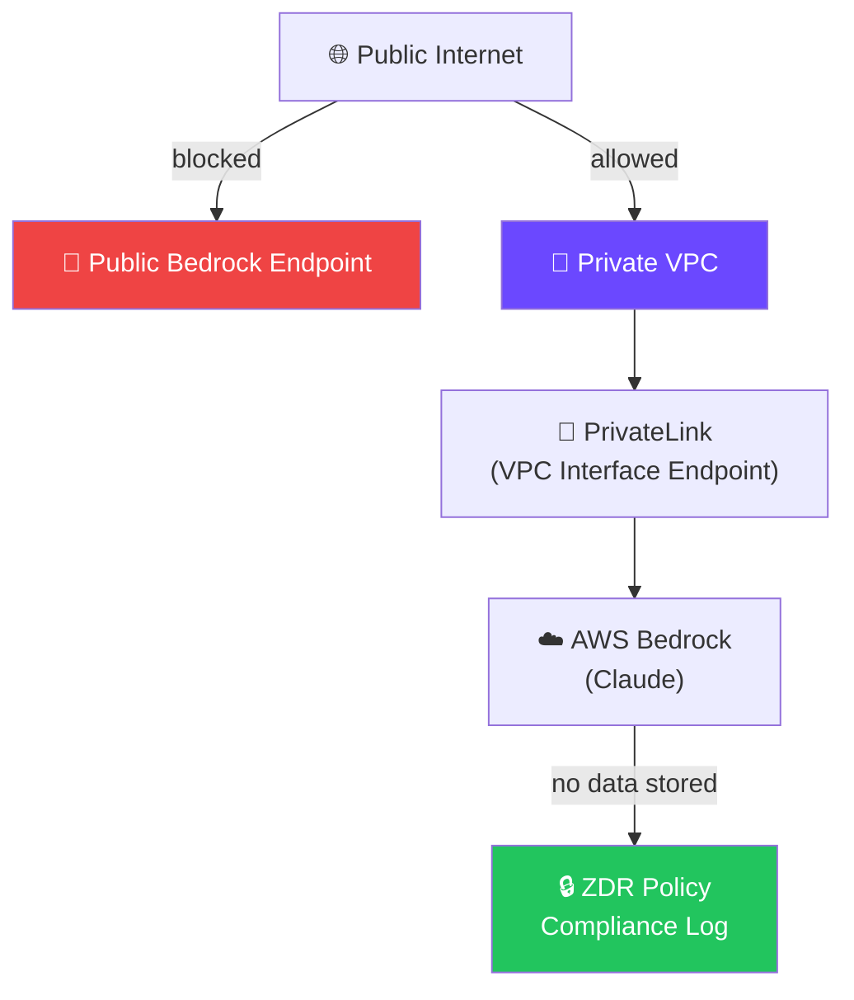
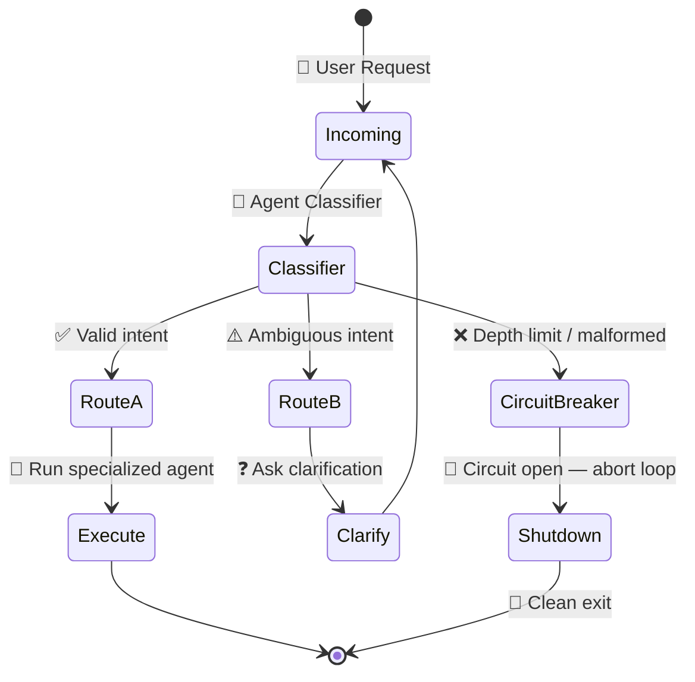
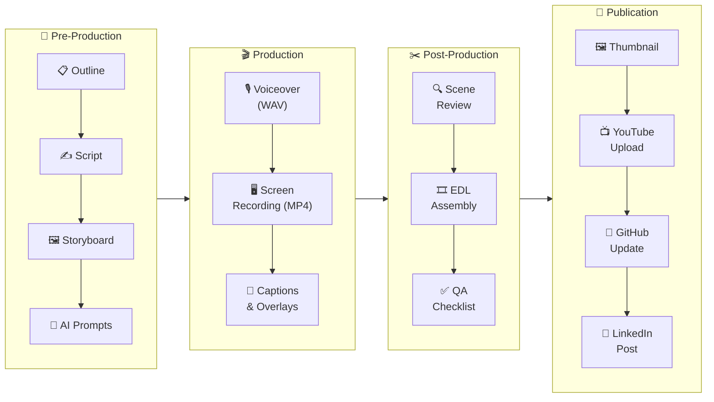
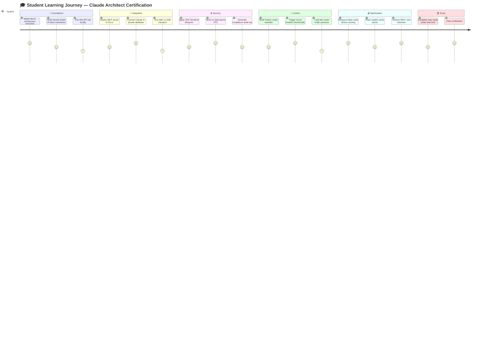
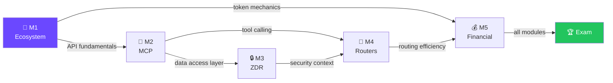
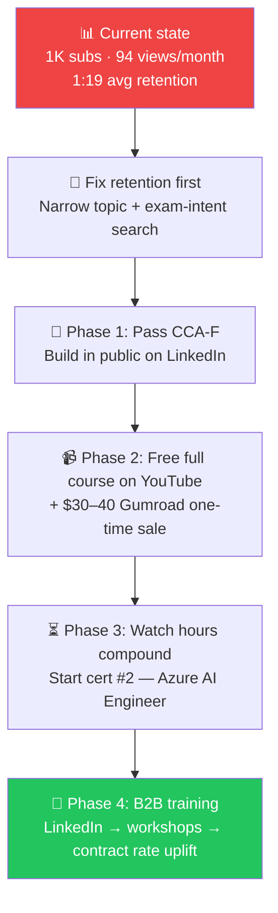

# 🎬 YouTube Course Structure — Feedback & Analysis

> **📁 Stage 4: Formula** — Thinking & planning review of the YouTube course structure for the Claude AI Architect Certification series.

---

## 🗺 Course at a Glance

---

## 📊 Structure Scorecard

| 🏷 Dimension | ⭐ Score | 💬 Comment |
|---|---|---|
| 📐 Logical progression | ✅ 5/5 | Ecosystem → MCP → Security → Control → Cost is a natural build-up |
| 🎯 Exam alignment | ✅ 5/5 | 1-to-1 mapping between modules and exam topics |
| ⚖️ Video balance | ✅ 5/5 | Consistent 3-video-per-module rhythm — predictable for learners |
| 💻 Hands-on density | ⚠️ 3/5 | Theory-to-code ratio feels even; could push more live demos earlier |
| 🔗 Cross-module links | ⚠️ 3/5 | Dependencies exist but aren't explicit to the viewer mid-series |
| 🔰 Beginner ramp | ⚠️ 2/5 | No introductory "zero-to-Claude" video before Module 1 |

---

## 🔬 Module-by-Module Feedback

### 📡 Module 1 — Claude Ecosystem & Flows

| 🏷 Item | 💬 Feedback |
|---|---|
| ✅ Strength | Token mechanics + architecture diagram = strong mental model anchor |
| ✅ Strength | Multi-agent routing patterns set up Modules 2–4 perfectly |
| ⚠️ Gap | No "What is Claude?" 60-second teaser — assumes too much prior knowledge |
| 💡 Suggestion | Add a 2-min hook video before V1: real enterprise problem → Claude solves it |

---

### 🔌 Module 2 — Model Context Protocol (MCP)

| 🏷 Item | 💬 Feedback |
|---|---|
| ✅ Strength | stdio vs SSE transport comparison is exactly what architects need |
| ✅ Strength | Fly.io deployment makes it immediately production-replicable |
| ⚠️ Gap | "Enterprise MCP" video covers auth broadly — needs a concrete OAuth/mTLS example |
| 💡 Suggestion | Show a failing unauthenticated request BEFORE the secure fix — more memorable |

---

### 🔒 Module 3 — Zero-Data Retention (ZDR)

| 🏷 Item | 💬 Feedback |
|---|---|
| ✅ Strength | Terraform blueprint is the killer differentiator — no other course has this |
| ✅ Strength | Compliance logging adds real enterprise credibility |
| ⚠️ Gap | "Why ZDR matters" could be opened with a data-breach cost headline to create urgency |
| 💡 Suggestion | Include a `terraform plan` live output demo — architects trust infra-as-code artifacts |

---

### 🔀 Module 4 — Deterministic Routers

| 🏷 Item | 💬 Feedback |
|---|---|
| ✅ Strength | Circuit breaker pattern is under-taught — this is a genuine gap-fill |
| ✅ Strength | Loop detection is exam-critical and well positioned |
| ⚠️ Gap | No mention of timeout budgets — architects need latency SLA examples |
| 💡 Suggestion | Add a "rogue loop" live demo in V1 showing the problem before the solution |

---

### 💰 Module 5 — Financial Engineering

| 🏷 Cache State | 💰 Cost per 1M Tokens ($) | 📊 Visual Comparison |
|---|---|---|
| **No Cache** | $15.00 | █ █ █ █ █ █ █ █ █ █ █ █ █ █ █ (100%) |
| **50% Cache Hit** | $7.50 | █ █ █ █ █ █ █ (50%) |
| **90% Cache Hit** | $1.50 | █ (10%) |

| 🏷 Item | 💬 Feedback |
|---|---|
| ✅ Strength | "90% savings" headline is a compelling hook — leads with business value |
| ✅ Strength | Prefix-matching mechanics are technical enough to satisfy architects |
| ⚠️ Gap | No mention of cache TTL expiry edge cases (5-min window) — exam gotcha |
| 💡 Suggestion | Build a live cost dashboard with real API calls — screenshot-worthy for LinkedIn |

---

## 🏗 Production Pipeline Review

| 🏷 Phase | ⭐ Rating | 💬 Note |
|---|---|---|
| 🎯 Pre-Production | ✅ Excellent | Script + outline + AI prompts pipeline is solid |
| 🎬 Production | ⚠️ Good | Needs explicit B-roll checklist for architecture diagrams |
| ✂️ Post-Production | ⚠️ Needs work | EDL template exists but composite preview step undefined |
| 🚀 Publication | ✅ Excellent | LinkedIn → YouTube → GitHub cross-promotion loop is smart |

---

## 🧠 Learning Journey Map

---

## 💡 Top 5 Improvement Suggestions

| 🏷 Priority | 💡 Suggestion | 🎯 Impact |
|---|---|---|
| 🔴 P1 | Add a 2-min "zero-to-Claude" intro video before Module 1 | Lowers barrier for new viewers |
| 🔴 P1 | Show cache TTL expiry edge case in Module 5 V1 | Covers likely exam trap question |
| 🟡 P2 | Add latency SLA / timeout budget discussion to Module 4 | Rounds out router architecture |
| 🟡 P2 | Include a concrete OAuth/mTLS example in Module 2 V3 | Makes "Enterprise MCP" real |
| 🟢 P3 | Build a live cost dashboard demo in Module 5 V3 | Creates shareable LinkedIn proof |

---

## 🔗 Content Dependency Graph

> 📌 **Key insight:** Module 2 (MCP) is the critical dependency — it feeds both the security track (M3) and the control track (M4). If a student skips or rushes M2, they will struggle with both downstream modules.

---

## 🎙 Raw AI Feedback Session — Key Insights

> 📅 Session date: 2026-06-10 | 🤖 Source: AI strategy review of the repo

### 🔴 Critical Gaps Identified

**1. Exam alignment gap (highest risk)**
The modules are infra-heavy (ZDR, Bedrock PrivateLink, Terraform, Fly.io). But the actual CCA-F exam weights agent architecture and orchestration highest at 27%. **Claude Code doesn't appear in the course outline at all.** Either add a Claude Code module or reposition the course as "production architecture" rather than exam prep.

**2. The word "official"**
The README calls this the "official production-grade companion" for a certification name not owned by this repo. Say "unofficial companion repo for my CCA-F prep masterclass" and add a one-line disclaimer to avoid confusion and takedown risk.

**3. 92 broken `file:///` links**
Markdown across the repo links to `file:///Users/rifaterdemsahin/...` — dead for every viewer on GitHub/Pages and leaking local paths. Extend `test_links.py` to scan all markdown, not just `5_Symbols/production`.

**4. Supabase RLS audit**
The anon key is in `index.html`, and the project ref + dashboard links appear in `.env.example`, `nav.js`, and a public `admin.html`. Audit that every table has restrictive RLS and the service key never reaches client code.

---

### 📺 YouTube Channel & Monetization Strategy

### 🏗 Recommended Business Model

| 🏷 Layer | 💡 Approach | 💰 Timeline |
|---|---|---|
| 🆓 Free tier | Module 1 of every course + Shorts for discovery | Now |
| 💳 One-time purchase | $30–40 per course on Gumroad (no YPP needed) | Phase 2 |
| 🔑 Membership | Full library access at £9.99/month after YPP | Phase 3 |
| 🏢 B2B training | Corporate workshops via LinkedIn — highest ROI | Phase 4 |

### 🎯 Channel Niche Decision

**Chosen niche: AI Certifications across vendors** (CCA-F → Azure AI Engineer → GCP ML Engineer)

- ✅ Same viewer takes each cert — audience compounds instead of resets
- ✅ High search intent, thin competition right now
- ✅ Each badge posted on LinkedIn raises contract day rate
- ⚠️ Requires ~one new cert course every 6–8 weeks to sustain membership value
- ⚠️ Don't announce multi-cert identity until first complete loop (pass + course published)

### 📣 Recruiter Positioning

**Key message:** SC-cleared SRE + certified AI architect who builds in public and teaches enterprise production patterns — not prompting content.

> See `4_Formula/production/script.md` for the full LinkedIn post variants (journey, announcement, InMail reply).

---

## ✅ Feedback Action Items

- [ ] 🔴 Write and record 2-min "zero-to-Claude" intro hook video
- [ ] 🔴 Add cache TTL expiry demo to Module 5 Video 1
- [ ] 🔴 Add Claude Code module (or reposition course as "production architecture")
- [ ] 🔴 Remove "official" from README — add unofficial disclaimer
- [ ] 🔴 Fix 92 broken `file:///` links — extend `test_links.py` to all markdown
- [ ] 🔴 Audit Supabase RLS on all tables; move `admin.html` out of public repo
- [ ] 🟡 Write latency SLA section for Module 4 script
- [ ] 🟡 Add mTLS code snippet to Module 2 Video 3 (`enterprise_mcp.py`)
- [ ] 🟢 Design live cost dashboard for Module 5 Video 3
- [ ] 🟢 Create cross-module dependency callout cards for each video intro
- [ ] 📋 Update [`course_outline.md`](certification/course_outline.md) after implementing changes
- [ ] 🧪 Validate all changes against [`7_Testing_Known/`](../7_Testing_Known/) checklist

---

_📅 Last updated: 2026-06-10 | 🤖 Stage: 4_Formula | 🏷 Type: Course Review_
