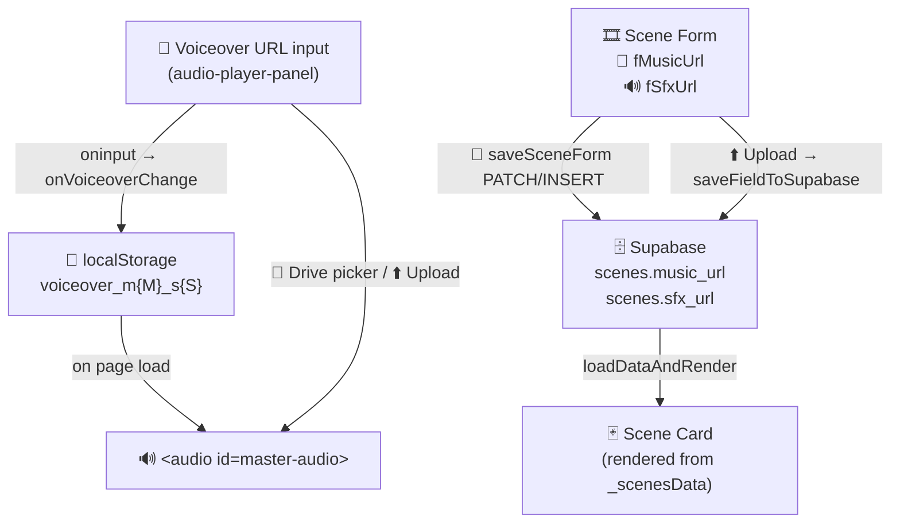

# 🧠 Formula: Audio Structure — Voiceover / Music / SFX

> **Stage:** `4_Formula` — Thinking & Planning
> **Implemented in:** `5_Symbols/production/postprod/production_shotlist.html`
> **Related errors:** `6_Semblance/error_ref_doc_url_column_missing.md`

---

## 🎯 Design Decision

Audio is split across two levels to match real post-production workflow:

| 🏷 Level | 🎵 Audio Type | 📦 Storage | 🗄 Supabase |
|---------|-------------|-----------|-----------|
| 🎬 **Video** (section) | 🎤 Voiceover narration | `localStorage` keyed by module+section | — (no DB write needed) |
| 🎞 **Scene** | 🎵 Background music | `scenes.music_url` | ✅ DB column |
| 🎞 **Scene** | 🔊 Sound effects | `scenes.sfx_url` | ✅ DB column |

**Why this split:**
- Voiceover spans the entire video — it makes no sense to attach it to a single scene
- Music and SFX are scene-specific — different scenes have different moods
- Voiceover is edited once per video session and doesn't need to survive a DB round-trip

---

## 🗄 Supabase Schema Changes

Run once in [Supabase SQL Editor →](https://supabase.com/dashboard/project/rmekfsdhglyiralxvkwc/sql/new)

```sql
-- Add music and SFX columns (IF NOT EXISTS = safe to re-run)
ALTER TABLE scenes ADD COLUMN IF NOT EXISTS music_url TEXT DEFAULT '';
ALTER TABLE scenes ADD COLUMN IF NOT EXISTS sfx_url   TEXT DEFAULT '';

-- Note: audio_url was the old column name.
-- If it exists on your instance, rename it first:
-- ALTER TABLE scenes RENAME COLUMN audio_url TO music_url;
```

> ⚠️ Error `42703: column "audio_url" does not exist` → column was never created or already renamed. Skip the RENAME, run the ADD COLUMN statements only.

---

## 🏗 Architecture — Data Flow



---

## 💻 Key Code — JS Implementation

### 🎤 Voiceover (video-level localStorage)

```javascript
// Save + update player whenever URL changes
function onVoiceoverChange(url) {
  const key = `voiceover_m${moduleKey}_s${sectionKey}`;
  localStorage.setItem(key, url);
  const player = document.getElementById('master-audio');
  if (player) player.src = url ? toGDriveEmbedUrl(url) : '';
}

// On page load — restore from localStorage
const voiceoverKey = `voiceover_m${moduleKey}_s${sectionKey}`;
const savedVoiceover = localStorage.getItem(voiceoverKey) || '';
document.getElementById('fVoiceoverUrl').value = savedVoiceover;
if (savedVoiceover) audioPlayer.src = toGDriveEmbedUrl(savedVoiceover);
```

### 🎵 Music + 🔊 SFX (scene-level Supabase)

```javascript
// FIELD_TO_COLUMN map — used by saveFieldToSupabase after upload
const FIELD_TO_COLUMN = {
  fBg:          'bg_image',
  fMusicUrl:    'music_url',   // 🎵 scene background music
  fSfxUrl:      'sfx_url',     // 🔊 scene sound effects
  fLtImg:       'lt_image',
  fOverlayLt:   'overlay_lt',
  fOverlayText: 'overlay_text',
  fRefDocUrl:   'ref_doc_url'
};

// Scene body in saveSceneForm
const sceneBody = {
  music_url: document.getElementById('fMusicUrl').value,
  sfx_url:   document.getElementById('fSfxUrl').value,
  // ... other fields
};

// loadDataAndRender mapping from DB row
musicUrl: s.music_url || '',
sfxUrl:   s.sfx_url   || '',
```

---

## 🖼 Google Drive Image Display Fix

When a background image uploaded to Drive was invisible in the scene card, root cause was `uc?export=view` returning an HTML interstitial page instead of image bytes for files over ~25MB.

**Fix:** use thumbnail API which always serves image bytes directly:

```javascript
function toGDriveEmbedUrl(url, hint) {
  // ...
  if (isAudio)   return `https://drive.google.com/uc?export=download&id=${id}`;
  if (isArchive) return `https://drive.google.com/uc?export=download&id=${id}`;
  // Images → thumbnail API (no interstitial, no CORS issues)
  return `https://drive.google.com/thumbnail?id=${id}&sz=w800`;
}
```

| ❌ Old URL format | ✅ New URL format |
|---|---|
| `uc?export=view&id=...` | `thumbnail?id=...&sz=w800` |
| Returns HTML interstitial for large files | Returns raw image bytes always |
| `` shows nothing | `` shows image ✅ |

---

## 🧪 Testing Checklist

- [ ] 🎤 Paste a Drive URL into the Voiceover panel → `<audio>` src updates live
- [ ] 🎤 Reload page → Voiceover URL persists from localStorage
- [ ] 🎵 Open scene form → Music URL field present with 📁 Drive + ⬆️ Upload
- [ ] 🔊 Open scene form → SFX URL field present with 📁 Drive + ⬆️ Upload
- [ ] 💾 Save scene → `music_url` + `sfx_url` written to Supabase
- [ ] 🖼 Upload background image → visible in scene card (thumbnail API)
- [ ] 🗄 Supabase `scenes` table has `music_url` + `sfx_url` columns

---

## 📅 History

| Date | Event |
|---|---|
| 2026-06-09 | 🧠 Designed audio split: voiceover (video) vs music+sfx (scene) |
| 2026-06-09 | 💻 Implemented: fMusicUrl, fSfxUrl, onVoiceoverChange, FIELD_TO_COLUMN updated |
| 2026-06-09 | 🐛 Bug: bg_image uploaded but invisible → Drive `uc?export=view` returns HTML |
| 2026-06-09 | ✅ Fix: thumbnail API `/thumbnail?id=&sz=w800` serves raw image bytes |
