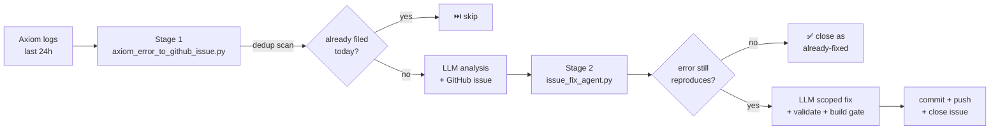

# 🤖 Autonomous Error Loop — Tech Formula

> 🏷 **Label:** 🚀 DELIVERY PILOT — reusable framework component
> 📁 **Sources:**
> &nbsp;&nbsp;&nbsp;&nbsp;[`6_Semblance/tools/axiom_error_to_github_issue.py`](../6_Semblance/tools/axiom_error_to_github_issue.py) — *stage 1: scan → issue*
> &nbsp;&nbsp;&nbsp;&nbsp;[`6_Semblance/tools/issue_fix_agent.py`](../6_Semblance/tools/issue_fix_agent.py) — *stage 2: issue → patch → close*
> 🔗 **Upstream:** [`4_Formula/tools/axiom_logging_setup.md`](./tools/axiom_logging_setup.md), [`4_Formula/tools/axiom_query_guide.md`](./tools/axiom_query_guide.md)
> 🧠 **Planning log:** [`4_Formula/llm_thinking_log.md`](./llm_thinking_log.md) → 2026-06-27 "Hardening the Autonomous Error Loop"

This is the **how & why** companion to the two-agent loop that turns raw Axiom error logs into closed, fixed issues — *without a human in the middle*. It documents the pipeline, the **de-duplication algorithm** (the part that stops issue spam), and the **safety gates** that stop the resolver from breaking the codebase.

---

## 🎯 What it does (in one breath)

Every run, **stage 1** queries the last 24h of Axiom `ERROR`/`FATAL` logs, asks an LLM for a root-cause analysis, and files a labelled GitHub issue — **but only after scanning every existing `axiom-error` issue (open *and* closed) from the dedup window and refusing to file a duplicate.** Then **stage 2** pulls each open issue, **verifies the error still reproduces**, asks the LLM for a scoped fix, **validates** the generated file, runs the **build gate**, and commits + closes.



---

## 🧱 The three stages

| 🔢 | 📜 Script | ⚙️ Responsibility | 🛡️ Key guarantee |
|----|-----------|-------------------|------------------|
| 0 | (Axiom ingest) | App/Go server + browser ship `error`/`fatal` logs to Axiom | — |
| 1 | `axiom_error_to_github_issue.py` | Query → analyse → **dedup** → file issue | **Never opens the same error twice** (esp. same day) |
| 2 | `issue_fix_agent.py` | Pull issue → verify → fix → build → close | **Never clobbers a working file** or breaks the build |

---

## 🛡️ Stage 1 — the de-duplication algorithm (the important part)

> **Origin of this design:** on 2026-06-27 the loop created **issues #10–#14 — five copies of one error** — in eight minutes. The old script always filed `errors[0]` with no memory of what it had already filed. This algorithm is the fix.

### Two dedup keys

Every Axiom match is reduced to **two signatures**:

| 🔑 Key | 🔧 Computed from | 🎯 Catches |
|--------|------------------|------------|
| `row_id` | The exact Axiom `_rowId` (or `_sysTime` fallback) | The **literal same log row** re-fired |
| `fingerprint` | `sha1(stage | source | normalise(message))` | The **same logical error** reported from a *different* row (e.g. a second browser session, or a re-deploy) |

`normalise(message)` lower-cases the text, collapses whitespace, and **strips `scheme://host[:port]`** so that the same `SyntaxError` on `localhost:8080` and on `claude-cert.fly.dev` collapses to **one** fingerprint. The `:line:col` is deliberately **kept**, because a different line in the same file is a genuinely different bug.

### The scan

`fetch_existing_signatures(window_days)` calls the GitHub Issues API with `labels=axiom-error`, `state=all`, and `since=<now - window_days>`. For every issue it extracts `(row_id, fingerprint)` by:

1. **Reading hidden markers** embedded in the body (`<!-- axiom-row-id: … -->`, `<!-- axiom-fp: … -->`), then
2. **Falling back** to parsing the ` ```json ``` ` metadata block and re-deriving the signatures — so **legacy issues created before the markers existed (#10–#14) are still recognised**.

### The gate (in `main()`)

For each fresh error, **before** calling the LLM:

```text
if row_id in known_row_ids      → SKIP  (exact row already filed)
if fingerprint in known_fp      → SKIP  (same error already filed in window)
if analysis failed (404/402/…)  → SKIP  (never file a noise issue)
else                            → FILE  + register its keys in-memory
```

The default window is **`DEDUP_WINDOW_DAYS=1`** = "today", directly implementing *"don't open the same error twice, especially on the same day."* Set it to `3`/`7` to suppress chronic noise; `0` disables dedup entirely (dangerous).

---

## 🧹 Stage 2 — the resolver's safety gates

The resolver (`issue_fix_agent.py`) is the dangerous half — it writes code. Four gates stop it from doing harm:

| 🚦 Gate | 🧪 Check | ❌ On failure |
|---------|----------|----------------|
| 1. **Verify-before-apply** | Re-parse the named HTML file's inline `<script>` blocks (Node) | Error no longer reproduces → **close as *already-fixed***, don't touch code |
| 2. **Validate output** | Generated HTML's inline JS must parse; generated Go must `gofmt -e` | **Refuse to write** the file (tree untouched) |
| 3. **Build gate** | `go build ./... && go vet ./...` from the repo root | **`git restore .`** (revert) + leave issue open |
| 4. **Scope** | Parse `file:line:col` from the issue; send focused context to the LLM | Avoids the generic, wrong full-file rewrites that #14 produced |

Run it safely first with `--dry-run` (no writes, no commits, no closes).

> **Why gate 1 exists:** issues #10–#14 reported a `SyntaxError` that was *already fixed* in commit `5af0765` before the agent ever ran. Without the verify gate, the LLM would have overwritten a working file. The resolver now **proves the error still exists** before changing anything.

---

## 🔧 Configuration

All knobs are environment variables (no config file). The scripts auto-load from `.env` only when invoked via the shell wrappers; otherwise export them inline.

### Stage 1 — `axiom_error_to_github_issue.py`

| 🔧 Var | 📌 Default | 💡 Purpose |
|--------|-----------|------------|
| `AXIOM_TOKEN` | — *(required)* | Query the dataset |
| `AXIOM_DATASET` | `videoproduction` | Dataset name |
| `OPENROUTER_API_KEY` | — *(required)* | LLM analysis |
| `OPENROUTER_MODEL` | `anthropic/claude-sonnet-4.6` | Known-good slug (verified live via `GET /api/v1/models`). `claude-3.5-sonnet` and `opus-4.6` are both 404 now — a dead default silently zeroes the whole loop. |
| `GITHUB_TOKEN` | `gh auth token` fallback | Issue read/write |
| `GITHUB_REPOSITORY` | `owner/repo` | Target tracker |
| `DEDUP_WINDOW_DAYS` | `1` | Scan window (open+closed). `0` = off |

### Stage 2 — `issue_fix_agent.py`

| 🔧 Var | 📌 Default | 💡 Purpose |
|--------|-----------|------------|
| `OPENROUTER_API_KEY` | — *(required)* | Generate the fix |
| `OPENROUTER_MODEL` | `anthropic/claude-sonnet-4.6` | — |
| `--dry-run` | flag | Plan-only; no writes/commits/closes |

### Running

```bash
# Stage 1 — file issues (dedup is automatic)
export AXIOM_TOKEN=… OPENROUTER_API_KEY=… GITHUB_REPOSITORY=owner/repo
python3 6_Semblance/tools/axiom_error_to_github_issue.py

# Stage 2 — resolve issues (try dry-run first)
python3 6_Semblance/tools/issue_fix_agent.py --dry-run
python3 6_Semblance/tools/issue_fix_agent.py            # live
```

> 🔐 **Token hygiene:** `GITHUB_TOKEN` falls back to `gh auth token` so the agent runs locally without a separate PAT. Never commit secrets. The Supabase *service* key stays server-side only.

---

## 🔁 Daily CI (runs automatically)

The whole loop runs **unattended every day at 02:00 UTC** via [`/.github/workflows/axiom_issue_creator.yml`](../.github/workflows/axiom_issue_creator.yml) (also manually triggerable via `workflow_dispatch`). It chains **both** stages in one job:

1. **Stage 1** → `axiom_error_to_github_issue.py` (a no-op if Axiom has no fresh `ERROR`/`FATAL` rows, or all are deduped).
2. **Stage 2** → `issue_fix_agent.py` → verify → fix → `go build` gate → commit → push → close (a no-op if no `axiom-error` issues are open).

Design choices baked into the workflow:

| 🔧 Knob | 💡 Why |
|---------|--------|
| `OPENROUTER_MODEL: anthropic/claude-sonnet-4.6` set **explicitly** | A dead model slug silently zeroes the loop (see the 2026-06-27 incident). Pinning it in CI means a deprecation is a one-line fix, not a silent 8-row skip. |
| `permissions: contents: write, issues: write` | Stage 2 commits/pushes; both stages read/write issues. |
| `setup-go` + `setup-node` | Stage 2 needs `go build` (build gate) and `node` (verify-before-apply JS parse). |
| `persist-credentials: true` + git bot identity | Lets stage 2 push its fix commit to `main`. |
| `continue-on-error` on stage 1 only | A flaky Axiom query must not block stage 2 from resolving issues filed earlier. |
| `concurrency: error-loop` | Never two loops racing (which is what produced the #10–#14 duplicate spam). |

---

## 🧬 The hidden markers (contract for stage 1's issue bodies)

Stage 1 appends two HTML-comment markers to every issue body. They are the **stable dedup contract** — the human-readable body template above them may change freely:

```html
<!-- axiom-row-id: 0djjrps84efwg-08aea3e08f00246e-00000d7f -->
<!-- axiom-fp: 220e55e1f5a3310715ddad3afbf70dc674d68fb1 -->
```

* If you change the fingerprint algorithm, **bump the marker name** (e.g. `axiom-fp-v2`) so old issues aren't falsely matched against the new scheme.
* Legacy issues without markers are handled by the JSON-block fallback in `signatures_from_issue()`.

---

## ✅ How to verify the dedup works

```bash
# 1) Unit-check the signature logic (no network)
python3 -c "import axiom_error_to_github_issue as m; \
  print(m.compute_signatures({'_rowId':'x','data':{'message':'E — /a.html:1:1','stage':'UI-Client','source':'client'}}))"

# 2) Live-scan the real tracker against today's issues
GITHUB_TOKEN="$(gh auth token)" \
python3 -c "import axiom_error_to_github_issue as m; \
  m.GITHUB_REPOSITORY='rifaterdemsahin/claude-architect-certification'; \
  print(m.fetch_existing_signatures(1))"
```

A replay of any already-filed row/fingerprint prints `⏭️ Skip …` and is **not** re-filed.

---

## 📓 Lessons baked into the code

| # | 💥 What happened | 🛠️ What changed |
|---|------------------|-----------------|
| #10–#14 | 5 issues for 1 Axiom row in 8 min | Double dedup (row_id + fingerprint) + scan open **and** closed + same-day window |
| #11–#13 | "Failed to analyze… 404/402" issues | Skip-on-analysis-failure (no noise issues) |
| #10–#13 | `anthropic/claude-opus-4.6` → 404; later `claude-3.5-sonnet` also removed (404) | Configurable `OPENROUTER_MODEL`, default pinned to a slug verified live (`claude-sonnet-4.6`); the daily CI sets it explicitly so a deprecation can't silently break the run |
| #14 | LLM proposed a wrong generic `sed` fix | Verify-before-apply + validate-output + build gate in the resolver |

---

## 🔭 Future enhancements (not yet built)

- 🧾 Per-fingerprint **rate limiting** (e.g. max 1 issue per fingerprint per week, beyond the same-day window).
- 🔁 **Re-open on regression**: if a fingerprint that was *closed* re-appears after N days, file a *regression* issue instead of deduping.
- 🧪 **CI integration**: run stage 2 against a preview branch and open a PR rather than committing straight to `main`.
- 📊 Emit dedup stats (`filed`/`skipped`/`noise`) to Axiom so the loop can observe itself.
