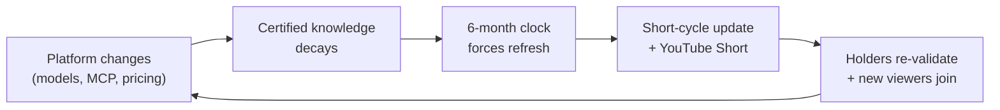
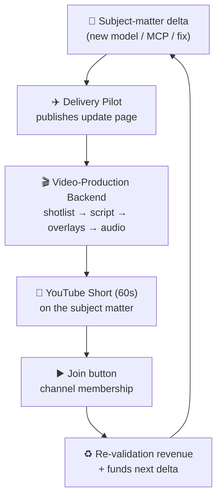
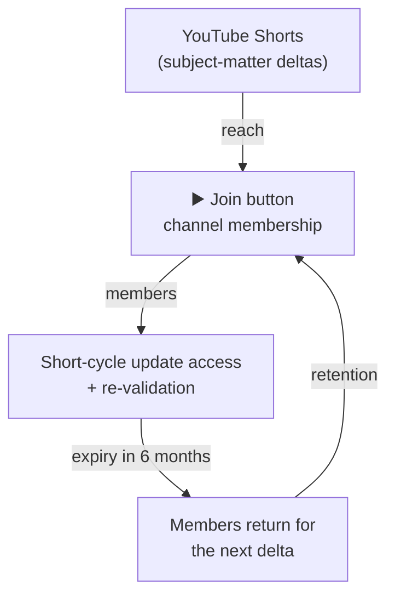

# ⏳ Certificate Validity & The Continuous Post-Production Engine

> **Purpose:** Define the **6-month validity window** for the Claude Architect Certification and the post-production pipeline that keeps it current — using **Delivery Pilot** plus a **video-production backend** to ship short-cycle updates and YouTube Shorts that feed the channel-membership **Join** business.

---

## 🚨 The 6-Month Validity Rule

Unlike a static diploma, an architecture certification ages the moment the underlying platform moves. Model families, MCP capabilities, pricing, and security primitives shift every few weeks. A certificate that vouches for *stale* knowledge actively misleads employers.

| Property | Policy |
|----------|--------|
| **Validity window** | **6 months** from the issue date stamped on the certificate |
| **Why so short** | Claude model lineup, MCP spec, pricing, and ZDR/security posture all change on a sub-quarterly cadence |
| **Expiry behaviour** | Certificate moves to `EXPIRED`; holder must complete the latest *delta module* to re-validate |
| **Re-validation** | Pass the current short-cycle update assessment (not the full course) to reset the 6-month clock |
| **Verification** | Each certificate carries an `issued_at` + `expires_at` (issued + 6 months) so anyone can check freshness |

> **Principle:** A certificate is a **freshness guarantee**, not a trophy. Six months is the longest we can honestly promise the material still matches the live platform.

This makes **new updates more vital than ever** — the certification is only as trustworthy as the content stream that keeps refreshing it.

---

## 🔄 Why Short-Cycle Updates Are Now Vital

If updates ship slowly, certificates expire faster than they can be renewed and the credential loses meaning. The only sustainable answer is a **production line for small, frequent updates** rather than occasional large course re-records.

---

## ✈️ Delivery Pilot × Video-Production Backend

The renewal cadence is powered by two cooperating systems already in this repository:

1. **Delivery Pilot** (`4_Formula/delivery_pilot/`) — the single-page engine + Supabase/Fly.io backend that serves course content, tracks navigation favourites, and renders markdown. It is the **delivery and state layer**.
2. **Video-Production Backend** (`5_Symbols/production/`, `4_Formula/production/`) — the post-production toolchain (shotlists, teleprompter scripts, overlays, audio, ZIP asset bundles) that turns a topic into a publishable clip.

Wiring them together gives a **short-cycle update loop**:

| Stage | System | Output |
|-------|--------|--------|
| Detect delta | Delivery Pilot | New update page in the course tree |
| Draft | Video-Production Backend | Teleprompter script + shotlist (`post_prod_template.md`) |
| Assemble | Video-Production Backend | Overlays, master audio, scene ZIP bundle |
| Publish short | YouTube | 60s vertical Short on the subject matter |
| Convert | YouTube **Join** | Channel membership sign-ups |
| Re-validate | Delivery Pilot | Holders reset their 6-month clock |

---

## 📱 YouTube Shorts as the Promotion Layer

Each subject-matter delta is sliced into a **60-second Short** that does double duty: it teaches the update *and* markets the certification.

- **Hook (0–5s):** the breaking change — *"Your Claude cert expires in 6 months. Here's what just changed."*
- **Body (5–50s):** one concrete delta (a new model id, an MCP capability, a pricing shift) demoed live.
- **CTA (50–60s):** point at the **Join** button and the re-validation page served by Delivery Pilot.
- **Pinned comment:** link to the open-source repo + the certificate re-validation flow.

Rhythm aligns with the existing plan in `business_plan.md`: **3 short vertical clips per week**, each derived from a real platform delta rather than invented filler.

---

## ▶️ Building the Business on the Join Button

The 6-month clock is the engine of a recurring, membership-funded business:

- **Join button = recurring revenue.** Channel membership turns one-off viewers into members who need the *next* update to keep their certificate valid.
- **Expiry drives retention.** The 6-month window gives members a concrete, honest reason to stay subscribed.
- **Shorts drive reach.** Every delta is a new top-of-funnel Short, feeding the funnel described in `business_plan.md` (YouTube → membership → re-validation).

See the membership page at `5_Symbols/production/publish/membership.html` and the flywheel at `5_Symbols/production/postprod/flywheel.html` for the publish-side implementation.

---

## ✅ Operating Checklist

- [ ] Stamp every issued certificate with `issued_at` + `expires_at` (issued + 6 months).
- [ ] Surface `EXPIRED` status and the re-validation CTA inside Delivery Pilot.
- [ ] For each platform delta: open an update page → run the video-production backend → publish a Short.
- [ ] Every Short ends on the **Join** button and links the re-validation flow.
- [ ] Keep the cadence at ≥3 Shorts/week so renewals outpace expiries.

---

> **Bottom line:** Short validity is a feature, not a bug. The 6-month window forces a fast, honest update cadence; Delivery Pilot and the video-production backend make that cadence cheap; YouTube Shorts turn each update into reach; and the Join button converts that reach into a self-funding membership business.
