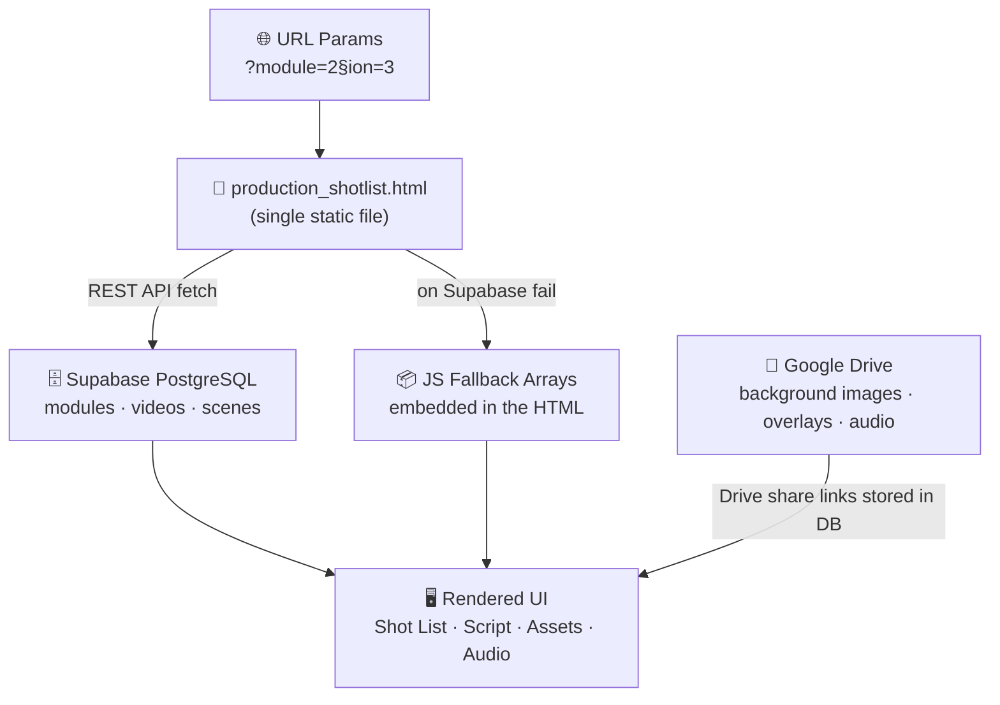

# 🧠 Single-Page Engine Formula — Self-Learning Certification System

> **Label:** 🚀 DELIVERY PILOT  
> **Stage:** `4_Formula` — Thinking & Planning  
> **Formula Type:** Architecture Pattern  

---

## 🎯 The Core Idea

One HTML file. One Supabase project. Every module, every section, every course asset — rendered dynamically via URL parameters.

Instead of shipping 25 separate HTML pages for 5 modules × 5 sections, you ship **one parameterised page** that fetches its data from a database:

```
production_shotlist.html?module=2&section=3
```

The page reads `?module` and `?section` from the URL, calls Supabase, and builds the entire UI at runtime.

---

## 🏗 Architecture Diagram



---

## 📋 How It Works — Step by Step

### 🔵 Step 1 — URL Parameters Drive State

The page reads two URL parameters on every load:

```js
const params = new URLSearchParams(window.location.search);
let moduleKey = params.get('module') || getCookie('last_module') || '1';
let sectionKey = params.get('section') || getCookie('last_section') || '1';
```

- **No params?** → falls back to last-used values via cookie, then defaults to Module 1, Section 1.
- **Invalid values?** → clamped to minimum `1` (modules and sections start at 1, never 0).
- **Changing selection?** → dropdowns call `window.location.search = ?module=X&section=Y`, reloading with new params. This keeps the URL bookmarkable and shareable.

### 🔵 Step 2 — Supabase Fetch (or Graceful Fallback)

On load, the page calls the Supabase REST API for the current module/section:

```js
// 1. Load module list
GET /rest/v1/modules?select=id,module_number,title&order=module_number.asc

// 2. Load videos (sections) for the selected module
GET /rest/v1/videos?select=module_id,video_number,title&order=video_number.asc

// 3. Load scenes for the selected module + section
GET /rest/v1/scenes?select=*&module_id=eq.X&video_id=eq.Y&order=scene_number.asc
```

**If Supabase is unreachable** (no API key, timeout, network error), the page falls back to hardcoded JS arrays embedded in the HTML:

```js
const MODULES_FALLBACK = [
  { id: 1, module_number: 1, title: "Module 1: Claude Ecosystem & Flows" },
  // ...
];
```

This means the page is **always functional** — even offline or before the database is seeded.

### 🔵 Step 3 — Scene Cards Rendered Dynamically

Each row from the `scenes` table becomes a **scene card** in the UI:

| DB Column | UI Element |
|-----------|-----------|
| `scene_number` | Scene badge / jump-to-scene index |
| `script` | Script text with emphasis markers |
| `timing` | Timing badge (0:00 – 0:30) |
| `bg` | Background image (Drive link or local path) |
| `lt_img` | Lower-third overlay image |
| `overlay_lt` | Left overlay composite |
| `overlay_text` | Text overlay |
| `bundle` | Full composite bundle image |
| `music_url` | Scene-level background music player |

Assets stored as Google Drive share links are resolved via `getAssetPath()`, which normalises Drive URLs to direct-download format.

### 🔵 Step 4 — Supabase as the Write-Back Engine

The page is not read-only. Instructors can:
- ✏️ **Create** new scene rows (scene form modal → `POST /rest/v1/scenes`)
- ✏️ **Edit** existing scenes (prefill form → `PATCH /rest/v1/scenes?id=eq.X`)
- 🗑 **Delete** scenes (`DELETE /rest/v1/scenes?id=eq.X`)
- 📤 **Upload** assets to Google Drive and store the link in the DB row

Every change is immediately reflected on any device viewing the same URL — no redeploy, no file edits.

---

## 🔬 Why One Page Beats Many Pages

| Approach | Pages to maintain | Adding a module | Adding a section |
|----------|------------------|-----------------|-----------------|
| ❌ One HTML per section | 5 modules × N sections = 25+ files | Create new file, copy, edit | Same |
| ✅ Single-page engine | **1 file** | Seed DB row → done | Seed DB row → done |

**The formula:** `static shell + dynamic data = infinite content at zero maintenance cost`

---

## 🧩 Self-Learning Loop — How the Certification Engine Works

```
┌─────────────────────────────────────────────────────────┐
│                  SELF-LEARNING CYCLE                    │
│                                                         │
│  1. LEARNER visits ?module=X&section=Y                  │
│     → Page loads script, assets, audio for that lesson  │
│                                                         │
│  2. INSTRUCTOR adds content via Supabase                │
│     → No redeploy — page auto-reflects new material     │
│                                                         │
│  3. LEARNER navigates via dropdowns                     │
│     → URL updates, cookie persists progress             │
│                                                         │
│  4. SYSTEM tracks what was viewed                       │
│     → Cookie / Supabase user_progress table             │
│                                                         │
│  5. CERTIFICATION unlocks when all modules complete     │
│     → Supabase RLS controls what is accessible          │
└─────────────────────────────────────────────────────────┘
```

### 🎓 The Certification Path

| Step | What happens | Where |
|------|-------------|-------|
| 📌 Enrol | User visits the course homepage | `index.html` |
| 🎬 Watch | Single-page engine renders Module N, Section N | `production_shotlist.html?module=N&section=N` |
| ✅ Complete | Scene completion state saved to Supabase `user_progress` | Supabase REST API |
| 🔓 Unlock | Next module/section becomes accessible | Supabase RLS policy |
| 🏆 Certify | All modules complete → certificate issued | Supabase function or webhook |

---

## 🔐 Supabase Schema (Core Tables)

```sql
-- Course structure
modules   (id, module_number, title, description)
videos    (id, module_id, video_number, title, voiceover_url)
scenes    (id, video_id, module_id, scene_number, timing, script,
           bg, lt_img, overlay_lt, overlay_text, bundle, music_url)

-- Learner progress (future)
user_progress (id, user_id, module_id, video_id, scene_id,
               completed_at, score)
```

Row-Level Security ensures learners only see modules they are enrolled in, and instructors can write to all tables.

---

## ⚙️ Configuration — How to Connect

The page reads Supabase credentials from `localStorage` (set via the ⚙️ Settings panel):

```js
const supabaseUrl = localStorage.getItem('supabase_url')
  || 'https://rmekfsdhglyiralxvkwc.supabase.co';
const supabaseKey = localStorage.getItem('supabase_anon_key') || '';
```

For production, the anon key is safe to expose — Supabase RLS enforces what each role can read/write. The service-role key stays in Azure Key Vault and is never embedded in the page.

---

## 🚀 Deployment Pattern

```
GitHub Pages  ──→  production_shotlist.html  (static shell, no server needed)
Supabase      ──→  modules, videos, scenes   (all dynamic content)
Google Drive  ──→  images, audio, overlays   (all binary assets)
Azure KV      ──→  service_role_key          (secrets, never in git)
```

**Zero backend cost at idle.** GitHub Pages and Supabase free tier handle the full certification pipeline until you scale to hundreds of concurrent learners.

---

## 📁 Related Files

| 📄 File | 🏷 Role |
|---------|---------|
| `5_Symbols/production/postprod/production_shotlist.html` | The single-page engine |
| `5_Symbols/supabase/` | Supabase schema and seed SQL |
| `2_Environment/11_database.md` | Supabase setup guide |
| `4_Formula/delivery_pilot/github_pages_supabase_stateful.md` | Cost formula for this stack |
| `4_Formula/delivery_pilot/decisions.md` | Why Supabase was chosen over alternatives |
