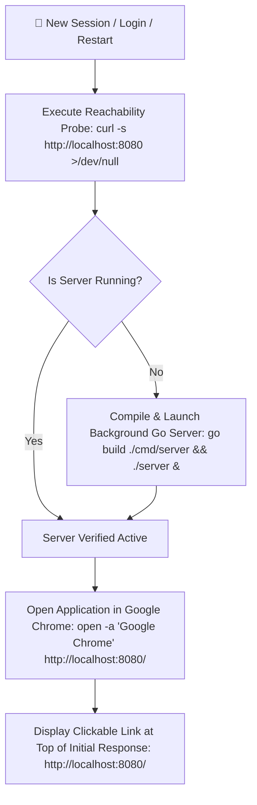

# ⚡ Mandatory Server Startup & Display — Tech Formula

> 🏷 **Label:** 🚀 DELIVERY PILOT — reusable framework component
> 📁 **Location:** `4_Formula/mandatory_server_startup_formula.md`
> 🧠 **Planning log:** [`4_Formula/llm_thinking_log.md`](./llm_thinking_log.md) → 2026-07-02 entry

This document outlines the **Mandatory Server Startup & Link Display Invariant**, an automated zero-prompt agent behavior designed to eliminate friction, prevent testing against stale static assets, and ensure seamless visual and functional verification upon session initialization or system restart.

---

## 🎯 What it does (in one breath)

Whenever an AI agent starts a new conversation session, logs into Antigravity (AGY), or recovers from a system restart, it **autonomously verifies and launches the local Go application server (`http://localhost:8080/`) in the background**, opens the active URL directly in **Google Chrome**, and **displays the clickable link at the very top of its initial response**—all without waiting for the user to ask.

---

## 🛑 The Problem: Session Friction & Stale Verification

In standard LLM pair-programming workflows, session boundaries introduce significant operational friction:
1. **Manual Prompting Tax:** Upon starting a new session or rebooting the machine, the user must manually instruct the AI: *"start the server"*, *"what port is it running on?"*, or *"open it in chrome"*.
2. **Stale Asset Testing:** If the server is offline, agents or users might accidentally open static HTML files directly via `file://` URIs. This bypasses backend API middleware (`/api/...`), Supabase database calls, and authentication gates, leading to false-positive test results.
3. **Scaffolding Deadlock:** Without immediate visual feedback in a browser, developers spend excessive time inspecting code rather than verifying live functionality.

---

## 🧱 The 4-Tier Multi-Document Hierarchy

To guarantee that any AI persona or model strictly obeys this rule across different IDEs and CLI tools, the invariant is redundant and permanently embedded across **4 core project configuration documents**:

| 📄 Document | 📍 Scope / Section | 🔧 Enforced Mandate |
|-------------|-------------------|-------------------|
| [`.agents/AGENTS.md`](../.agents/AGENTS.md) | **Project-Scoped Agent Rules** → `## ⚡ Mandatory Server Startup & Display on Session Start / Restart` | Requires immediate background launch, Chrome execution, and link display on session initialization. |
| [`GEMINI.md`](../GEMINI.md) | **Delivery Pilot Template** → `### Behavior Guidelines` | Defines the Gemini AI delivery pilot persona rule for automatic server reachability checks and zero-prompt startup. |
| [`agents.md`](../agents.md) | **Project-Wide Behavioral Guidelines** | Site-wide invariant prohibiting manual prompting for server startup and enforcing Chrome-only previewing. |
| [`AGENTS.md`](../AGENTS.md) | **Agent Activity Log** (`2026-07-01` & `2026-07-02`) | Chronological proof of implementation, verification, and multi-file synchronization. |

---

## 🔄 End-to-End Execution Workflow

When a new session begins, the AI agent executes the following idempotent workflow before generating its initial text response:

---

## 🛠 Technical Command Reference

Agents execute these exact bash commands using their command execution tools:

| ⚡ Step | 💻 Terminal Command | 📋 Purpose |
|--------|-------------------|-----------|
| **1. Reachability Probe** | `curl -s http://localhost:8080 >/dev/null` | Non-blocking check to see if port 8080 responds to HTTP requests. |
| **2. Build & Launch** | `go build ./cmd/server && ./server &` | Compiles the Go backend and runs the binary asynchronously in the background. |
| **3. Browser Preview** | `open -a "Google Chrome" http://localhost:8080/` | Forces Google Chrome to open or focus the active application tab. |
| **4. Link Display** | `http://localhost:8080/` | Rendered as clickable markdown at the very top of the agent's first reply. |

---

## 🚀 Impact on Autonomous Delivery

By turning server startup into an automatic reflex rather than a requested task:
- **Instant Readiness:** The user can click the link or check their open Chrome window immediately upon starting a chat.
- **Continuous Integration:** Every session starts with a compiled Go binary (`go build ./cmd/server`), catching compile-time syntax errors instantly before work begins.
- **Consistent Visual Loop:** Reinforces the rule: *never push UI changes unverified*.
