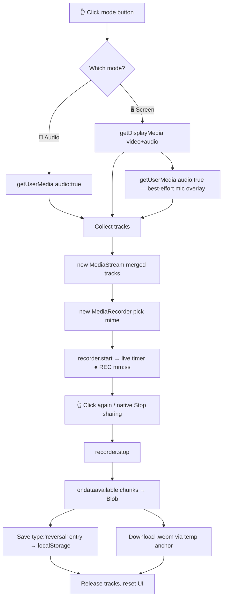

# 🎬 Reversal Recorder — Tech Formula

> 🏷 **Label:** 🚀 DELIVERY PILOT — reusable framework component
> 📁 **Source:** [`shared/reversal-recorder.js`](../shared/reversal-recorder.js)
> 🔌 **Wired by:** [`shared/nav.js`](../shared/nav.js) (loads on every page)
> 🧠 **Planning log:** [`4_Formula/llm_thinking_log.md`](./llm_thinking_log.md) → 2026-06-14 entry

This document explains **how the tech behind `reversal-recorder.js` works** — the browser APIs, the data flow, and the design decisions. It's the "why & how" companion to the code.

---

## 🎯 What it does (in one breath)

A fixed control at the **top-right of every page** with two one-click modes — **🎤 Audio** and **🖥 Screen**. Click a mode to start capturing, click again to stop. On stop it **saves a `type:'reversal'` entry to a local shot list** and **downloads the recording** as a `.webm` file. Hovering a button reads **"ACTION!"**.

---

## 🧱 The browser APIs it stands on

The whole feature is built from **four native Web APIs** — no libraries, no build step.

| 🧩 API | 🔧 Role in the recorder |
|--------|------------------------|
| `navigator.mediaDevices.getUserMedia()` | Captures the **microphone** stream (🎤 Audio mode, and the mic overlay in 🖥 Screen mode). |
| `navigator.mediaDevices.getDisplayMedia()` | Captures the **screen** (video + system audio) for 🖥 Screen mode. |
| `MediaStream` | The live container of audio/video **tracks**. We build a fresh one by merging tracks from the sources above. |
| `MediaRecorder` | Encodes the live `MediaStream` into a **webm Blob** in chunks, fired via `ondataavailable`. |

> 🔐 **Security gate:** `getUserMedia`/`getDisplayMedia` only work on a **secure context** (`https://` or `localhost`) and require a **user gesture** (the click) plus an explicit browser permission prompt. That's why one click *initiates* capture but the OS picker confirms it.

---

## 🔄 End-to-end data flow



---

## 🛠 Step-by-step mechanics

### 1️⃣ Self-injection on every page
`nav.js` already loads everywhere and computes the site `ROOT`. It appends one `<script>` for `reversal-recorder.js`, so the recorder appears site-wide **without hardcoding HTML per page** (the project's shared-component rule). A `window.__REVERSAL_RECORDER__` flag guards against double-loading.

### 2️⃣ Building the control
On `DOMContentLoaded` the IIFE injects a `<style>` block and a `#reversal-rec` container holding two `.rev-mode` buttons. Each button carries a `data-mode` (`audio` / `screen`), a pulsing `.rev-dot`, a label, and a hidden **"ACTION!"** tooltip (`.rev-tip`) revealed on hover via pure CSS.

### 3️⃣ Acquiring the streams
```js
// 🖥 Screen mode
const screenStream = await navigator.mediaDevices.getDisplayMedia({ video: true, audio: true });
// + best-effort mic so your voice is on the screencast
const micStream = await navigator.mediaDevices.getUserMedia({ audio: true });

// 🎤 Audio mode
const audioStream = await navigator.mediaDevices.getUserMedia({ audio: true });
```
All resulting tracks are pushed into one array, then wrapped in a fresh `new MediaStream(tracks)` so a single recorder sees screen video **and** mic audio together.

> 🩹 **Graceful degradation:** if the mic prompt is denied in Screen mode, we log it and keep going with screen audio only. If the user cancels the OS picker entirely, we silently reset — no error noise.

### 4️⃣ Choosing a codec
`pickMime(mode)` probes `MediaRecorder.isTypeSupported()` against a preference list and returns the first supported one:
- 🖥 Screen → `video/webm;codecs=vp9,opus` → `vp8,opus` → `video/webm`
- 🎤 Audio → `audio/webm;codecs=opus` → `audio/webm`

If none match, we construct `MediaRecorder` with no options and let the browser pick.

### 5️⃣ Recording + the live timer
`recorder.start()` begins buffering. `ondataavailable` pushes each `Blob` chunk into a `chunks[]` array. A `setInterval` updates the button label to `REC mm:ss` once per second, and the dot pulses red via CSS keyframes. The **other** mode button is disabled (`.disabled`) so you can't run both at once.

### 6️⃣ Stopping — two ways
- **Click the active button again** → `stop()`.
- **The browser's native "Stop sharing" bar** → each track gets an `ended` listener that also calls `stop()`.

Both paths call `mediaRecorder.stop()`, which fires `onstop` → `finalize()`.

### 7️⃣ Finalize: assemble, save, download
```js
const blob = new Blob(chunks, { type: recorder.mimeType });
const url  = URL.createObjectURL(blob);
// 1) persist metadata to the shot list (see below)
// 2) trigger download via a temporary <a download> anchor
// 3) stream.getTracks().forEach(t => t.stop())  // release camera/mic/screen
```
Releasing the tracks is what makes the browser's "recording" indicator and the screen-share bar disappear.

---

## 💾 "Saves to the shot list" — the storage decision

The existing shot list is the Supabase **`scenes`** table, but it has **no `type` column** and requires **module/section context** that doesn't exist on a global, every-page button. So reversal shots are stored in a dedicated **`localStorage` array** under the key **`reversal_shotlist`**:

```jsonc
{
  "id": "rev_1718380800000",
  "type": "reversal",          // ← the requested "type"
  "mode": "screen",            // "audio" | "screen"
  "page": "/5_Symbols/.../images.html",
  "title": "Research — Images",
  "filename": "reversal_screen_20260614_142640.webm",
  "startedAt": "2026-06-14T14:26:40.000Z",
  "durationMs": 18234,
  "sizeBytes": 482133,
  "url": "blob:http://localhost:8080/…"  // object URL, session-scoped
}
```

> ⚠️ **Why also download?** A `blob:` object URL is only valid for the current page session — it dies on reload. The simultaneous file download guarantees the footage is **never lost**, while the localStorage row gives a lightweight, cross-page index of what was captured.

🔭 **Future upgrade path:** add a `reversal_shots` Supabase table (+ migration) and POST entries server-side, with the blob uploaded to the `dpsbimages`-style storage bucket. The current localStorage layer is the MVP that needs zero backend changes.

---

## 🎨 UX affordances mapped to code

| ✨ Requirement | 🔩 Implementation |
|---------------|-------------------|
| Top-right, all pages | `position:fixed; top:10px; right:16px; z-index:10002` + injected via `nav.js` |
| Two modes | Two `.rev-mode` buttons keyed by `data-mode` |
| One-click start/stop | `toggle(mode)` checks `mediaRecorder.state === 'recording'` |
| Pulsing "recording" state | `.recording` class + `@keyframes rev-pulse` |
| Hover says **"ACTION!"** | `.rev-tip` shown via `:hover` (idle state only) + `title="ACTION!"` |
| Can't run both modes | non-active button gets `.disabled` while recording |

---

## 🧪 How to verify

1. ▶️ Run the app locally (`/run-local`) and open any page on `http://localhost:8080`.
2. 👀 Confirm the red **🎤 Audio** / **🖥 Screen** pills sit at the top-right; hover → **"ACTION!"**.
3. 🎤 Click Audio → grant mic → talk → click again → a `reversal_audio_*.webm` downloads.
4. 🖥 Click Screen → pick a window → click again → a `reversal_screen_*.webm` downloads.
5. 🗂 In DevTools console: `JSON.parse(localStorage.getItem('reversal_shotlist'))` lists the saved entries.

---

## 📌 Key takeaways

- 🧰 **Zero dependencies** — four native media APIs do all the work.
- 🧩 **One shared file, one wiring line** — site-wide reach with no per-page edits.
- 🩹 **Fails soft** — denied mic, cancelled picker, or unsupported codec all degrade gracefully.
- 💾 **Belt-and-suspenders persistence** — download (durable file) + localStorage (queryable index).
