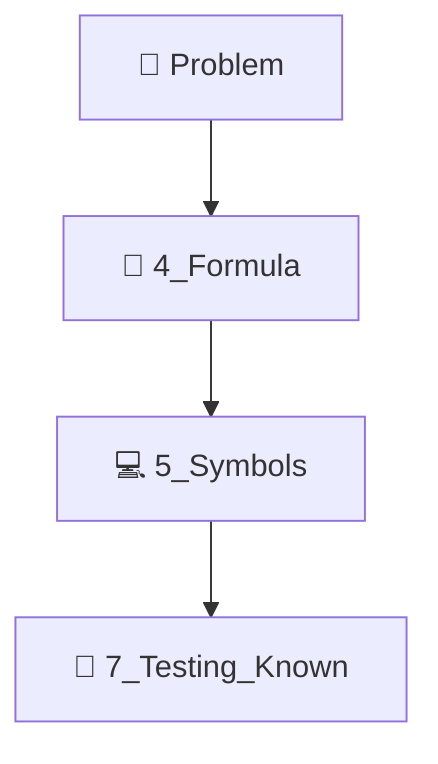
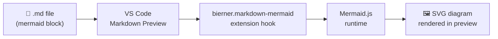

# 🧠 VS Code Mermaid Setup — MacBook Fix Guide

> **Stage:** 📁 4_Formula — Thinking & Planning
> **Date:** 2026-06-09
> **Problem:** Mermaid diagrams not rendering in VS Code markdown preview on macOS

---

## 🎯 Problem Statement

Mermaid diagrams (`\`\`\`mermaid` code blocks) appear as raw text in VS Code's markdown preview instead of rendering as visual diagrams on macOS.

---

## 🔬 Root Cause Analysis

### 1️⃣ Missing canonical extension
The primary extension that wires Mermaid into VS Code's built-in markdown preview is **`bierner.markdown-mermaid`**. Without it, no diagram renders.

### 2️⃣ Multiple conflicting Mermaid extensions ⚠️
Having several Mermaid-related extensions installed simultaneously can cause render conflicts. Detected on this machine:

| 🏷 Extension ID | 📝 Role | ✅ Keep? |
|---|---|---|
| `bierner.markdown-mermaid` | Markdown preview renderer — **the canonical one** | ✅ Required |
| `bpruitt-goddard.mermaid-markdown-syntax-highlighting` | Syntax highlighting in editor | ✅ Useful |
| `mermaidchart.vscode-mermaid-chart` | MermaidChart.com cloud integration | ⚠️ Optional |
| `tomoyukim.vscode-mermaid-editor` | Live `.mmd` file editor | ⚠️ Optional |
| `vstirbu.vscode-mermaid-preview` | Alternative preview (can conflict!) | 🚫 Disable if issues persist |
| `corschenzi.mermaid-graphical-editor` | Drag-and-drop visual editor | ⚠️ Optional |
| `nopeslide.vscode-drawio-plugin-mermaid` | Draw.io Mermaid plugin | ⚠️ Optional |

> 💡 If diagrams still don't render, **disable `vstirbu.vscode-mermaid-preview`** first — it registers as an alternate preview provider and can override the built-in one that `bierner.markdown-mermaid` targets.

### 3️⃣ Workspace Trust security blocks scripts
VS Code's Workspace Trust feature can block JavaScript execution in markdown previews (Mermaid renders via JS). Fix: set `security.workspace.trust.untrustedFiles: "open"`.

---

## 🛠 Fix Applied

### 📦 Extension installed
```bash
code --install-extension bierner.markdown-mermaid
```
**Version installed:** v1.32.1 (was already present — confirmed active)

### ⚙️ Settings added to `.vscode/settings.json`
```json
"markdown.mermaid.enabled": true,
"security.workspace.trust.untrustedFiles": "open"
```

---

## ✅ Verification Steps

1. Open any `.md` file containing a Mermaid block, e.g.:
   ```
   2_Environment/1_architecture.md
   ```
2. Press `Cmd+Shift+V` to open the Markdown Preview pane (or it auto-opens per workspace settings).
3. Confirm the diagram renders as a visual flowchart — not raw text.

### 🧪 Test Mermaid block
Paste this into any `.md` file to test:



---

## 🔧 If Still Not Working — Escalation Checklist

| ❓ Check | 🛠 Action |
|---|---|
| Extension not active in this workspace? | Click Extensions sidebar → search "mermaid" → ensure `bierner.markdown-mermaid` is **Enabled** (not just installed) |
| Preview showing blank white box? | Disable `vstirbu.vscode-mermaid-preview` — it can intercept the preview render |
| Diagram shows error "Syntax error"? | Validate Mermaid syntax at [mermaid.live](https://mermaid.live) |
| Restricted mode warning in status bar? | Click "Manage" → "Trust Workspace" |
| macOS Gatekeeper blocking extension? | Run `xattr -d com.apple.quarantine ~/.vscode/extensions/bierner.markdown-mermaid-*` |

---

## 📐 Architecture of How This Works



---

## 📚 References

- [bierner.markdown-mermaid on Marketplace](https://marketplace.visualstudio.com/items?itemName=bierner.markdown-mermaid)
- [VS Code Markdown Preview docs](https://code.visualstudio.com/docs/languages/markdown)
- [Mermaid.js official docs](https://mermaid.js.org)

---

## 🗒 Related Files

- ⚙️ `.vscode/settings.json` — workspace settings updated
- 🏛 `2_Environment/1_architecture.md` — uses Mermaid diagrams
- 📝 `../delivery_pilot/llm_thinking_log.md` — general planning log
