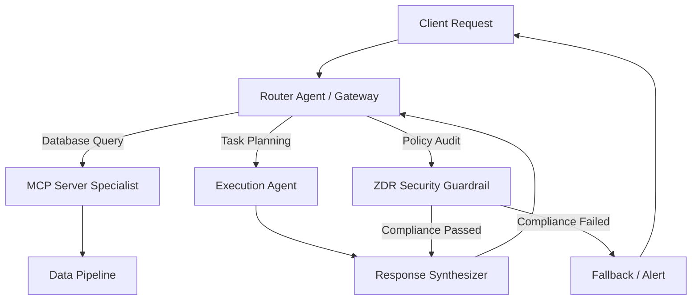

# Multi-Agent Routing & Topology

This document details the architectural topologies for deterministic multi-agent state machines, avoiding loops, and routing traffic between specialized LLM agents.

## 🗺️ Multi-Agent Architecture

## 🔄 Execution Loop Prevention (Guardrails)

To prevent infinite loops between multi-agent collaborations:
1. **Hop Count / Depth Budgeting**: Every request contains a routing header with a decrementing budget (e.g., `Max-Hops: 5`). When the count reaches `0`, the request is sent to a fallback error handler.
2. **State Transition Validation**: A deterministic state machine checks if the proposed next state is valid from the current state.
3. **Deterministic Fallbacks**: If the agent's confidence score drops below `0.70`, route to a human-in-the-loop queue or a deterministic rule-based script.
