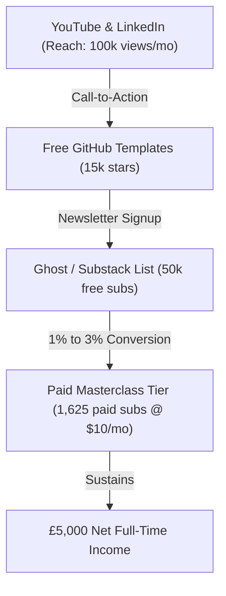

# 💰 Claude Architect Masterclass: Full-Time Business Plan

This document outlines the financial targets, subscriber metrics, OKRs, and content operations workflow required for Erdem to transition this masterclass into a full-time, self-sustaining business.

---

## 📊 Financial Model & Projections

To focus on this operation full-time, Erdem requires a personal net income of **£5,000/month**. 

### 1. The UK Tax & Personal Math
*   **Target Net Personal Income:** £5,000 / month (£60,000 / year)
*   **UK Tax & National Insurance (NI) Rate:** ~50% (estimated effective marginal rate for income tax, NI, and corporate distributions in the UK).
*   **Required Gross Personal Income:** £10,000 / month (£120,000 / year)

### 2. Business Operating & Safety Buffer
To run a sustainable business, Erdem needs a buffer to cover tools, transaction fees, churn, and reserves:
*   **Platform & Processing Fees (Stripe, Ghost/Substack):** ~10% (approx. £1,000/month)
*   **Operational Tools & AI Tokens (Anthropic API, Supabase, Fly.io):** ~5% (approx. £500/month)
*   **Subscriber Churn Variance Buffer:** ~15% (approx. £1,500/month)
*   **Total Monthly Buffer:** £3,000 / month

### 3. Gross Revenue & Subscriber Math
*   **Total Gross Business Revenue Required:** **£13,000 / month** (approx. **$16,250 / month** at a conservative exchange rate of £1 = $1.25 USD).
*   **Subscription Model:** **$10 / month** per subscriber.
*   **Active Paid Subscribers Needed:** **1,625 active subscribers**.

| Metric | Monthly Target | Annual Target |
|:---|:---|:---|
| **Net Income (Erdem)** | £5,000 | £60,000 |
| **UK Tax & NI (50%)** | £5,000 | £60,000 |
| **Business Buffer (30%)** | £3,000 | £36,000 |
| **Gross Business Revenue (GBP)** | **£13,000** | **£156,000** |
| **Gross Business Revenue (USD)** | **$16,250** | **$195,000** |
| **Paid Subscribers ($10/mo)** | **1,625** | — |

---

## 🎯 Objectives & Key Results (OKRs)

### 🏆 Objective 1: Establish Sovereign Subscription Engine
*   **KR 1.1:** Launch the paid subscription tier on Ghost or Substack at $10/month.
*   **KR 1.2:** Reach **1,625 paid active subscribers** within 12 months.
*   **KR 1.3:** Maintain subscriber churn rate below **5% monthly**.

### 📢 Objective 2: Build a High-Velocity Reach Funnel
*   **KR 2.1:** Accumulate **50,000 free newsletter subscribers** (top of funnel).
*   **KR 2.2:** Grow YouTube channel to **30,000 subscribers** with **100,000 monthly views**.
*   **KR 2.3:** Generate **15,000 stars** across open-source GitHub project repositories.

### ⚙️ Objective 3: Maintain Operational Consistency
*   **KR 3.1:** Deliver **2 high-density video case studies** per week.
*   **KR 3.2:** Maintain a **6-month cash reserve** (£18,000) inside the company account.
*   **KR 3.3:** Maintain 100% automated CI validation on all public code repositories.

---

## 📣 Reach & Acquisition Funnel

### 1. Top of Funnel (YouTube & LinkedIn)
*   **Strategy:** Publish short, highly-actionable architectural walkthroughs (e.g., "Outages on Fly.io", "Setting up ZDR in 5 minutes").
*   **Rhythm:** 2 videos per week on YouTube, syndicated as posts on LinkedIn.

### 2. Middle of Funnel (GitHub & Free Newsletter)
*   **Strategy:** Provide open-source code templates and structural schematics on GitHub to drive developers to the project list.
*   **Goal:** Capture emails by offering cheat sheets and private MCP server templates.

### 3. Bottom of Funnel (Paid Tier)
*   **Strategy:** Conversion of free subscribers using premium materials:
    *   Full production blueprints (Terraform, Node/Typescript source).
    *   Interactive simulation dashboards and architectural sandboxes.
    *   Weekly private Q&A/troubleshooting community calls.

---

## 🗓 Weekly Production & Operations Plan

To achieve these metrics, Erdem must execute a tight, repeatable weekly rhythm:

*   **Monday (Pre-Production):**
    *   Identify target enterprise problem statements (Stage 1).
    *   Draft script hooks and architectural blueprints (Stage 4).
*   **Tuesday (Production):**
    *   Record raw screencasts and vocal tracks in a noise-controlled studio (Stage 5).
    *   Ingest logs to Axiom and run verification checkruns.
*   **Wednesday (Post-Production):**
    *   Edit footage, splice transitions, and overlay lower third markers.
    *   Package code assets into downloadable ZIP archives.
*   **Thursday (Publication & Launch):**
    *   Publish video to YouTube and send out the newsletter broadcast.
    *   Share open-source updates on GitHub and LinkedIn.
*   **Friday (Community & Optimization):**
    *   Engage with paid subscribers in the comments and community forums.
    *   Review weekly metrics and adjust marketing copy.
