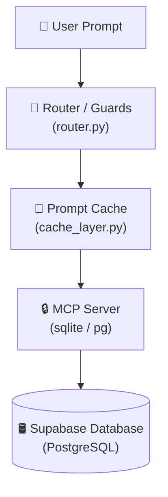

# 🌌 Antigravity Workspace Ledger & Project Init

This document serves as the operational ledger and initialization context for **Antigravity**, the Gemini-powered AI agent assistant. It maps key system components, active design principles, and tracking metrics for the **Claude AI Certification for Architects** repository.

---

## 🏛️ System Overview & Architecture Map

This project provides reference implementations and an interactive dashboard for enterprise AI integration patterns focusing on **Sovereignty, Security, and Optimization**.

---

## 📂 Project Structure & Navigation Links

Key entry points in the workspace:

- **Database Schemas & Data Seeds:**
  - Database Schema: [schema.sql](file:///Users/rifaterdemsahin/Projects/claude-architect-certification/5_Symbols/supabase/schema.sql)
  - Database Seed: [seed.sql](file:///Users/rifaterdemsahin/Projects/claude-architect-certification/5_Symbols/supabase/seed.sql)
- **Web Dashboards & Checklists:**
  - Interactive Project Hub: [index.html](file:///Users/rifaterdemsahin/Projects/claude-architect-certification/index.html)
  - Production Management: [production_hub.html](file:///Users/rifaterdemsahin/Projects/claude-architect-certification/5_Symbols/production_hub.html)
  - Local Markdown Viewer: [markdown_viewer.html](file:///Users/rifaterdemsahin/Projects/claude-architect-certification/5_Symbols/markdown_viewer.html)
  - Sanity Review Dashboard: [sanity_checklist.html](file:///Users/rifaterdemsahin/Projects/claude-architect-certification/5_Symbols/sanity_checklist.html)
- **Course Certification & Planning Docs:**
  - Master Production Plan: [production_plan.md](4_Formula/certification/production_plan.md)
  - Course Outline Guide: [course_outline.md](4_Formula/certification/course_outline.md)
  - Exam & Outage Case Studies: [exam_and_case_study.md](4_Formula/certification/exam_and_case_study.md)

---

## 🎯 Antigravity Active Mission

To collaborate on production-ready AI workflows, ensuring:
1. **Deterministic Orchestration:** Implementing loop breakers and strict routers.
2. **Zero-Data Retention (ZDR):** Building Terraform templates for secure endpoints.
3. **Model Context Protocol (MCP):** Implementing private database integrations on Fly.io.
4. **Cost Optimization:** Developing prompt caching layer middleware with up to 90% savings.

---

## 📅 Roadmap Tracking

- [ ] **Module 1: Claude Ecosystem & Flows**
  - [x] Schema design & base migrations
  - [x] Scripts database integration & RLS
  - [ ] Stateful orchestration loop tests
- [ ] **Module 2: Model Context Protocol (MCP)**
  - [ ] Write SSE/Stdio transports
  - [ ] Fly.io deployment config
- [ ] **Module 3: Zero-Data Retention (ZDR)**
  - [ ] Bedrock Interface Endpoint Terraform configurations
- [ ] **Module 4: Deterministic Routers**
  - [ ] Circuit breaker depth-check scripts in Python
- [ ] **Module 5: Financial Engineering**
  - [ ] Prompt Caching benchmarks

---

## 🪵 Activity Log

### 2026-06-07 (VS Code Extension Audit & Update)
- **Action:** Scanned project tech stack (HTML/CSS/JS, Python, Mermaid, YAML, Markdown, Supabase, Azure, Fly.io) and installed/updated all 26 required extensions from `4_Formula/tools/vscode_extensions.md`.
- **Newly installed:** `ecmel.vscode-html-css`, `esbenp.prettier-vscode`, `formulahendry.auto-rename-tag`, `christian-kohler.path-intellisense`, `charliermarsh.ruff`, `yzhang.markdown-all-in-one`, `hnw.vscode-auto-open-markdown-preview`, `mikestead.dotenv`, `eriklynd.json-tools`, `usernamehw.errorlens`, `oderwat.indent-rainbow`, `wayou.vscode-todo-highlight`, `supabase.vscode-supabase-extension`, `tamasfe.even-better-toml`, `flyio.sprites-for-vscode`.
- **Updated to latest:** `bierner.markdown-mermaid`, `mermaidchart.vscode-mermaid-chart`, `ms-python.python`, `ms-python.vscode-pylance`, `davidanson.vscode-markdownlint`, `github.vscode-github-actions`, `redhat.vscode-yaml`.
- **Already current / pre-installed:** `ritwickdey.liveserver`, `eamodio.gitlens`, `ms-azuretools.vscode-azureresourcegroups`.
- **Not available in marketplace:** `bertt.key-vault-secrets-viewer`, `ms-azuretools.vscode-azurekeyvault` — Key Vault management is handled via the existing `ms-azuretools.vscode-azureresourcegroups` extension.
- **Status:** All reachable extensions installed and up to date.

### 2026-06-07 (Project Initialization, Script Integration & Editor Page)
- **Action:** Created `antigravity.md` to initialize project context and mapping for Antigravity.
- **Action:** Added `scripts` table to database layer (`schema.sql` & `admin.html`) and developed inline script editing UI in pre-production script dashboard with localStorage support.
- **Action:** Created a dedicated script editor page `edit_scripts.html` in `production/preprod/` with sidebar selectors, character/word counters, objectives/KRs integration, and auto-sync to Supabase/localStorage overrides.
- **Status:** Completed, linked in pre-production dashboard, and tested. Ready for review.
